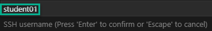

# Ansible solution from the Azure Marketplace Sub-Lab

1. From the Azure Portal create a new resource group called AnsibleDemo
    1. Click Resource Groups
    1. Click Add  
    1. Type `AnsibleDemo` in the Resource group field  
    1. Click Review + Create

    

1. Click Create

    

1. Create the Ansible Resource  
    1. Click Create a resource  
    1. Type `Ansible` in the search box  
    1. Select Ansible

    

1. Click Create

    

1. Fill in the Basics - Step 1
    > [!NOTE]
    > XX below = Student # provided by the Instructor  

    1. Name = `ansiblehostXX``
    1. User name = `studentXX`  
    1. Authentication type = password  
    1. Password = something you can remember  
    1. Confirm password = something you can remember again  
    1. Subscription = Instructor provided  
    1. Resource group = AnsibleDemo  
    1. Location = Instructor provided  
    1. Click OK  

    

1. Additional Settings - Step 2
    > [!NOTE]
    > XX below = Student # provided by the Instructor

    1. Size = 1x Standard B1ms  
    1. VM disk type = SSD  
    1. Public IP address = (new) ansible-pip  
    1. Domain name label = ```ansiblestudentXX```  
    1. Ansible version = latest  
    1. Click OK

    

1. Integration Settings - Step 3
    1. Integration Settings = Auto(MSI)  
    1. Click OK

    

1. Click OK on the Summary - Step 4

    

1. Click Create on Buy - Step 5

    

1. Type `Subscriptions` in the search box and then click Subscriptions  

    

1. Subscriptions Blade  
    1. Click your subscription  
    1. Click Access control(IAM)  
    1. Click Add role assignment  

    

1. Add role assignment blade
    > [!NOTE]
    > XX below = Student # provided by the Instructor  

    1. Role = Contributor  
    1. Assign access to = Virtual Machine  
    1. Subscription = Instructor provided  
    1. Select = ansiblehostXX  
    1. Click Save  

    

1. Launch VS Code  
    1. Open the AzureDemo01Playbook.yml file  
    1. Right-click the AzureDemo01Playbook.yml tab and select Run Ansible Playbook Remotely via ssh  

    

1. type in the FQDN label from Step 6 above and press Enter  

    

1. type 22 for the SSH port and press Enter  

    

1. type your User Name from step 5 and press Enter  

    

1. type your password from step 5 and press Enter  

    

1. Click no  

    

1. [Return to the Ansible Labs Outline](../README.md)