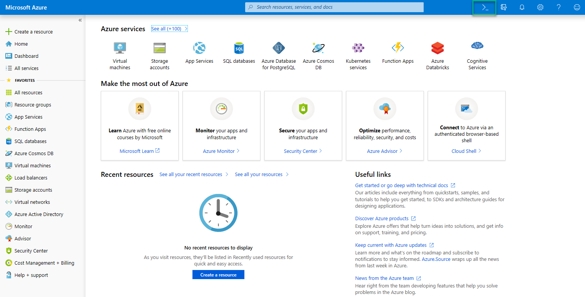
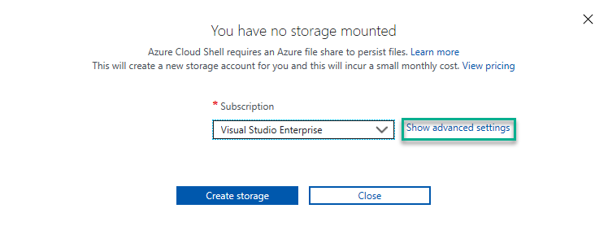
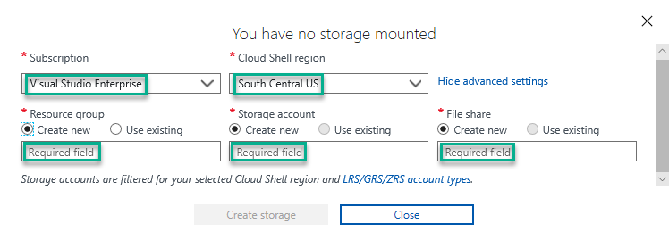
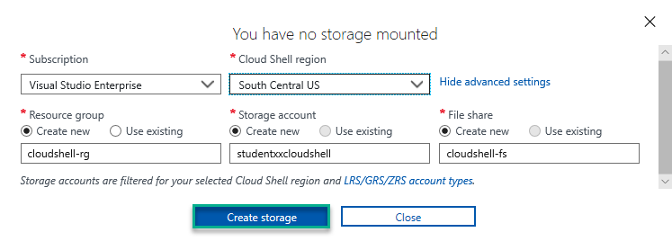
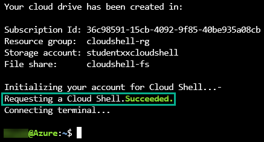

# Cloud Shell Sub-Lab

1. Access the Azure portal at [https://portal.azure.com](https://portal.azure.com)

1. Click the `Cloud Shell` icon in the upper right of the screen.

    

1. Click `Show advanced settings`.

    

1. Select the subscription and the Cloud Shell region then provide values for Resource Group, Storage Account, and File share.

    

    > [!IMPORTANT]
    > The Storage account name must be between 3 and 24 characters in length, use numbers and lower-case letters only, and be globally unique

1. After entering required values, click `Create storage`

    

1. Once provisioning is complete, you should see "`Requesting a Cloud Shell Succeeded`".

    

1. [Return to the Ansible Labs Outline](../README.md)