# Linux Sub-Lab

## Installing VSCode on Linux

> [!NOTE]
> These instructions will cover an apt based distro such as Ubuntu

1. Launch a terminal window by pressing `Ctrl-Alt-T`

    

1. Verify that the Microsoft signing key is not currently installed.

    ```bash
    apt-key list
    ```

    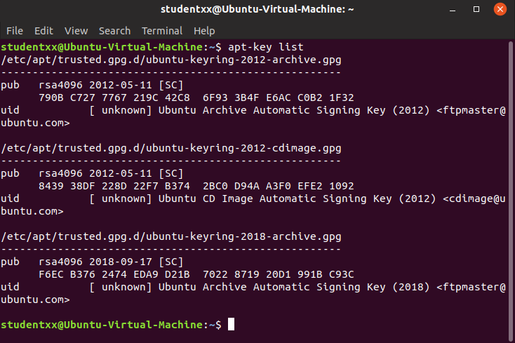

1. Add the Microsoft signing key to enable auto-updating of VSCode using Ubuntu's package manager.

    ```bash
    sudo apt-key adv --fetch-keys https://packages.microsoft.com/keys/microsoft.asc
    ```

    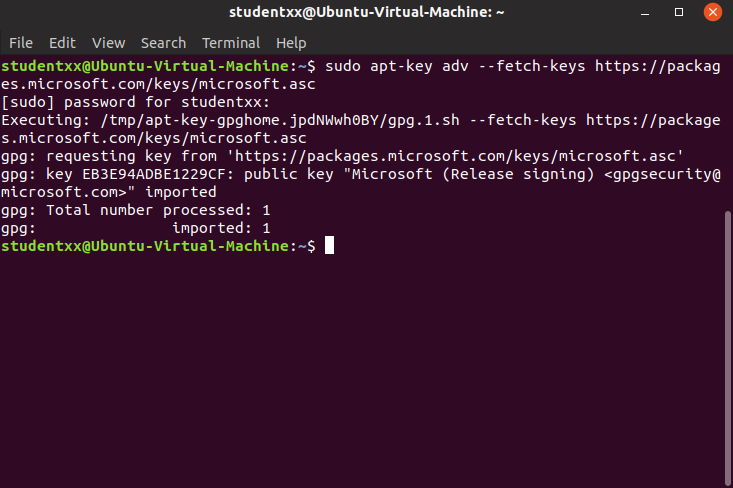

1. Verify that the Microsoft signing key is now installed.

    ```bash
    apt-key list
    ```

    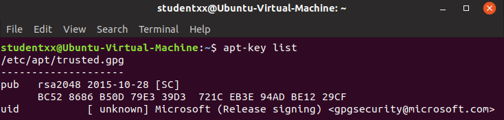

1. Add the Microsoft VSCode repository to the package manager.

    ```bash
    sudo add-apt-repository "deb [arch=amd64] https://packages.microsoft.com/repos/vscode stable main"
    ```

    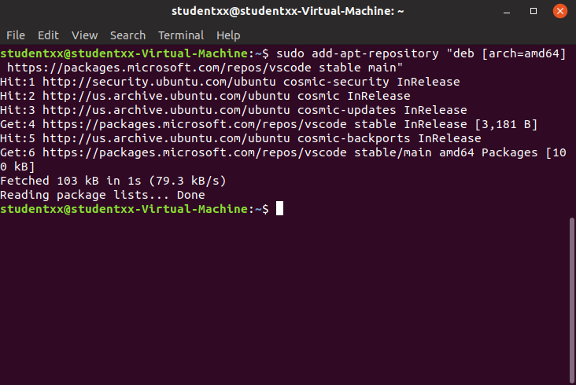

1. Install VSCode.

    ```bash
    sudo apt-get install code
    ```

    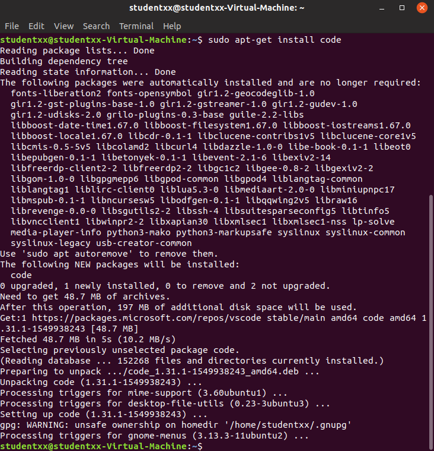

1. Verify VSCode installed properly.

    ```bash
    code
    ```

## Installing Node.js on Linux

> [!NOTE]
> These instructions will cover an apt based distro such as Ubuntu

1. Launch a terminal window by pressing `Ctrl-Alt-T`

    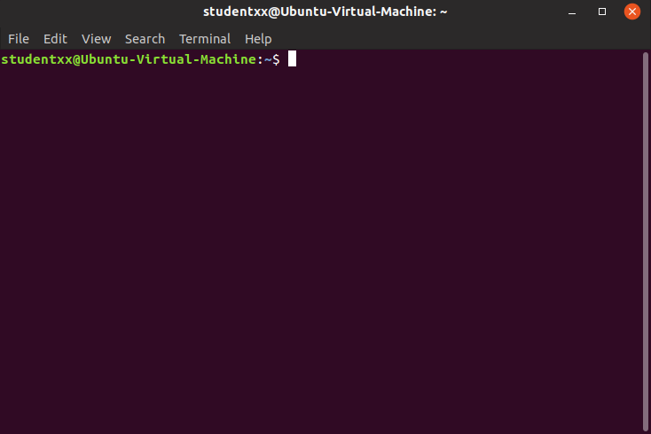

1. Install curl

    ```bash
    sudo apt-get install -y curl
    ```

    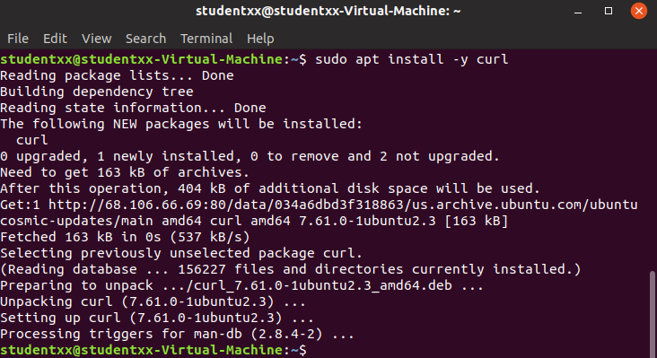

1. Add the NodeJs repository

      ```bash
    curl -sL https://deb.nodesource.com/setup_10.x | sudo bash -
    ```

    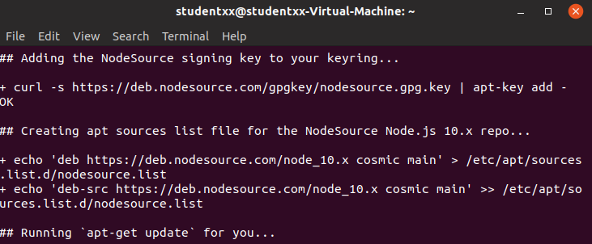

1. Install NodeJs

      ```bash
    sudo apt-get install -y nodejs
    ```

    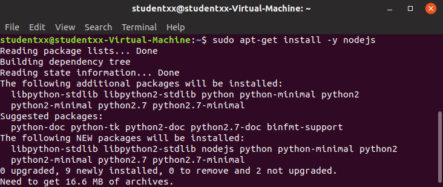

1. Verify NodeJs was successfully installed

      ```bash
    node -v
    ```

    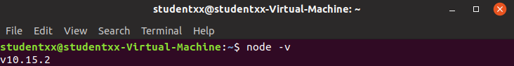

## Installing the VSCode Extensions on Linux

### Install the [Azure Account](https://marketplace.visualstudio.com/items?itemName=ms-vscode.azure-account) Extension

1. Launch a terminal window by pressing `Ctrl-Alt-T`

    

1. Install the Azure Account Extension

    ```bash
    code --install-extension ms-vscode.azure-account
    ```

    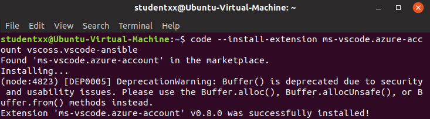

1. Verify that the Azure Account Extension was installed successfully

    ```bash
    code
    ```

    1. Select Extensions from the VSCode toolbar and verify that the Azure Account extension is enabled.

        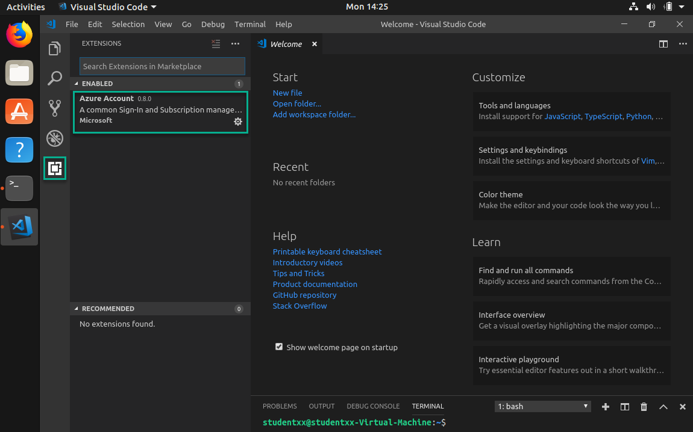

    1. Press `F1`, type `Azure: Sign In`, press `Return`

        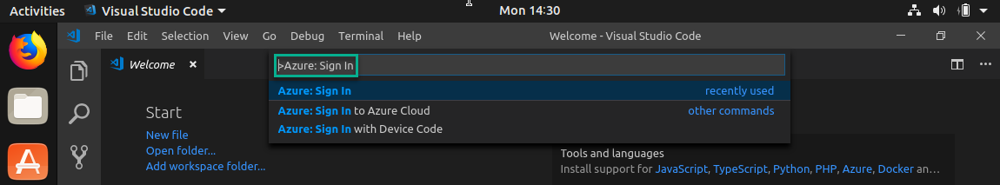

    1. Select the account associated with your Azure Subscription

        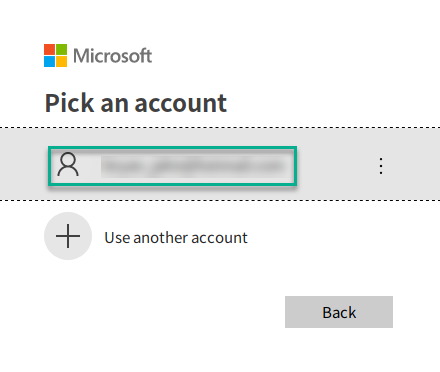

    1. Close the browser window that displays the successful sign on message

        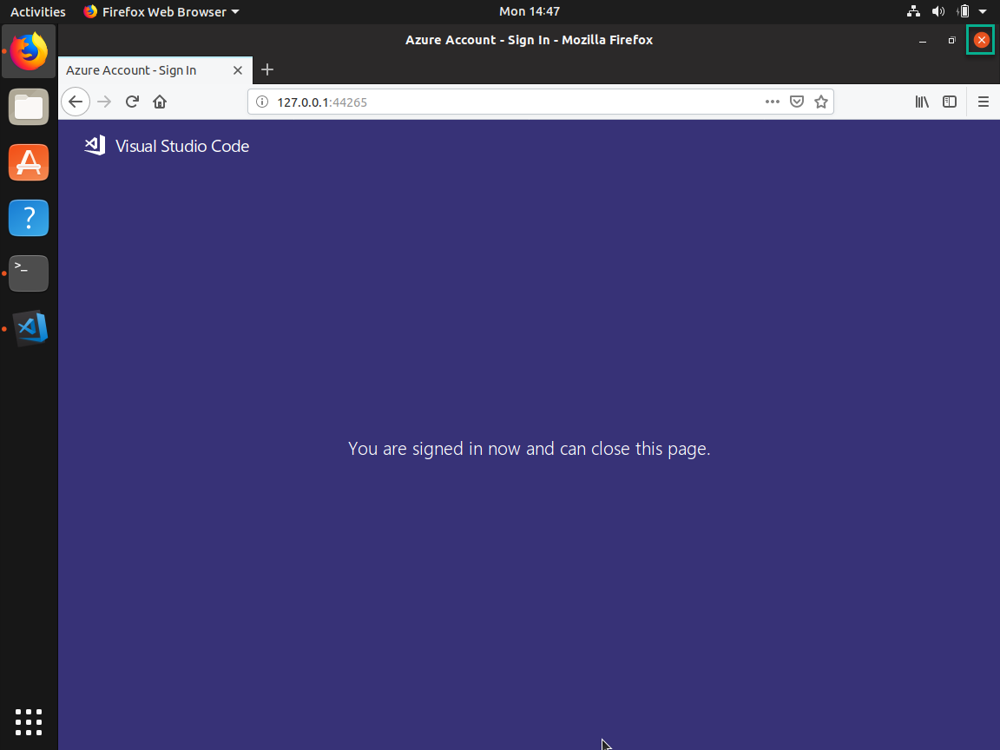

    1. Check the lower left corner of VSCode for Azure: followed by the account you signed in as.

        

        > [!TIP]
        > Clicking the account name will bring up a list of subscriptions associated with that account

    1. Close VSCode

### Install the [Ansible](https://marketplace.visualstudio.com/items?itemName=vscoss.vscode-ansible) Extension

1. Launch a terminal window by pressing `Ctrl-Alt-T`

    

1. Install the Ansible Extension.

    ```bash
    code --install-extension vscoss.vscode-ansible
    ```

    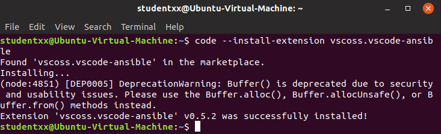

1. Verify that the Ansible Extension was installed successfully.

    ```bash
    code
    ```

    1. Select Extensions from the VSCode toolbar and verify that the Ansible extension is enabled.

        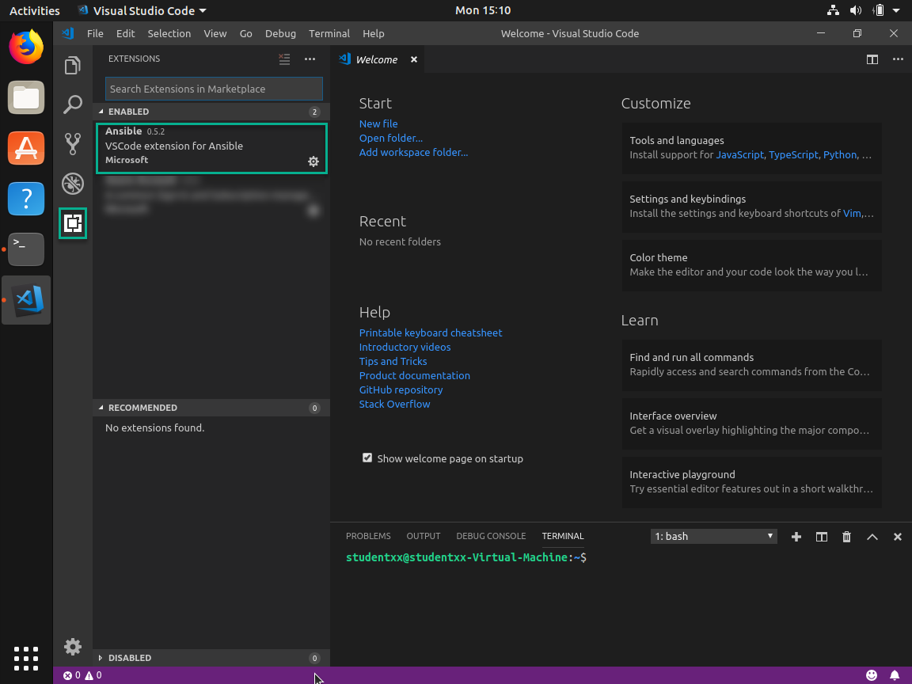

## This completes this section of the lab

1. [Return to the Ansible Labs Outline](../README.md)