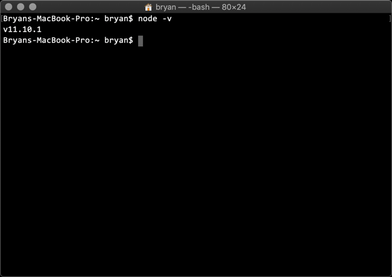

# macOS Sub-Lab

## Installing VSCode on macOS

> [!NOTE]
> These steps will cover the installation via Homebrew. If you do not have Homebrew installed, you can find the installation  instructions [here](https://brew.sh)

1. Launch a terminal window by pressing `⌘-T`

    

1. Update brew

    ```bash
    brew update
    ```

    

1. Tap the Caskroom/Cask repository on GitHub using HTTPS

    ```bash
    brew tap caskroom/cask
    ```

    

1. Search all known Casks for VSCode

    ```bash
    brew search visual-studio-code
    ```

    

1. Display information about the VSCode cask

    ```bash
    brew cask info visual-studio-code
    ```

    

1. Install VSCode

    ```bash
    brew cask install visual-studio-code
    ```

    

1. Verify VSCode was installed successfully

    ```bash
    code
    ```

    

## Installing Node.js on macOS

> [!NOTE]
> These steps will cover installation via Homebrew. If you do not have Homebrew installed, you can find the installation instructions [here](https://brew.sh)

1. Launch a terminal window by pressing `⌘-T`

    

1. Update brew

    ```bash
    brew update
    ```

    

1. Install Node.js

    ```bash
    brew install node
    ```

    

1. Verify NodeJs was successfully installed

      ```bash
    node -v
    ```

    

## Installing the VSCode Extensions on macOS

### Install the [Azure Account](https://marketplace.visualstudio.com/items?itemName=ms-vscode.azure-account) Extension for VSCode

1. Launch a terminal window by pressing `⌘-T`

    

1. Install the Azure Account Extension

   ```bash
    code --install-extension ms-vscode.azure-account
    ```

    

1. Verify that the Azure Account Extension was installed

    ```bash
    code
    ```

    1. Select Extensions from the VSCode toolbar and verify that the Azure Account extension is enabled.

        

    1. Press `F1`, type `Azure: Sign In`, press `Return`

        

    1. Select the account associated with your Azure Subscription

        

    1. Close the browser window that displays the successful sign on message

        

    1. Check the lower left corner of VSCode for Azure: followed by the account you signed in as.

        

        > [!TIP]
        > Clicking the account name will bring up a list of subscriptions associated with that account

    1. Close VSCode

### Install the [Ansible](https://marketplace.visualstudio.com/items?itemName=vscoss.vscode-ansible) Extension for VSCode

1. Launch a terminal window by pressing `⌘-T`

    

1. Install the Ansible Extension.

    ```bash
    code --install-extension vscoss.vscode-ansible
    ```

    

1. Verify that the Ansible Extension was installed successfully.

    ```bash
    code
    ```

    1. Select Extensions from the VSCode toolbar and verify that the Ansible extension is enabled.

        

## This completes this section of the lab

1. [Return to the Ansible Labs Outline](../README.md)