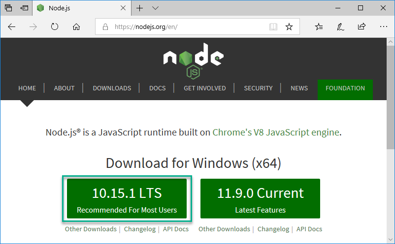

# Windows Sub-Lab

## Install Visual Studio Code for Windows  

1. Launch Microsoft Edge and browse to the [Visual Studio Code for Windows](https://aka.ms/win32-x64-user-stable) page.

    

1. Click Run

    

1. Click Next to start the VSCode Setup Wizard

      

1. Accept the license agreement and click Next

      

1. Verify/Change the installation folder and click Next

      

1. Verify/Change the Start Menu folder and click Next

      

1. Select Additional Tasks and then click Next

      

1. Click Next on the Ready to Install screen

      

1. Allow the installation of VSCode to complete

      

1. Click Finish to exit the VSCode Setup Wizard

    

## Install Node.js on Windows

1. Launch Microsoft Edge and browse to the [Node.js](https://nodejs.org) page.

    

1. Click the "Recommended for Most Users" version.  The version may differ from what is shown in the screenshot below.

    

1. Click Run

    
  
1. Click Next to begin the Node.js Setup Wizard

    
  
1. Accept the license agreement and click Next

    

1. Click next on the Destination Folder screen

    
  
1. Click Next on the Custom Setup screen

    
  
1. Click Install on the Node.js Setup screen

    
  
1. Click Yes on the User Account Control screen

    
  
1. Click Finish to exit the Setup Wizard

    

## Install VSCode Extensions on Windows

### Install the [Azure Account](https://marketplace.visualstudio.com/items?itemName=ms-vscode.azure-account) Extension  

> [!NOTE]
> On Windows, the Azure Account Extension requires that Node.js v6 or later be installed.
  
1. Launch VSCode type `Ctrl-Shift-X`
1. Type `Azure Account` in the search box
1. Click Install

      

### Install the [Ansible](https://marketplace.visualstudio.com/items?itemName=vscoss.vscode-ansible) Extension

> [!NOTE]
> This takes considerably longer to install than the Azure Account extension so be patient!

1. Launch VSCode and type `Ctrl-Shift-X`
1. Type `Ansible` in the search box
1. Click Install

    

## Install the Windows Subsystem for Linux

> [!NOTE]
> These instructions will cover an apt based distro such as Ubuntu

1. Enable the Windows Subsystem for Linux optional feature

    1. Launch PowerShell as Administrator and run the following command

    ```PowerShell
    Enable-WindowsOptionalFeature -Online -FeatureName Microsoft-Windows-Subsystem-Linux
    ```

    1. Restart your computer when prompted.

1. Download the Ubuntu distro

    1. Launch PowerShell as Administrator and run the following commands

    ```Powershell
    Invoke-WebRequest -Uri https://aka.ms/wsl-ubuntu-1804 -OutFile ~/Ubuntu.zip -UseBasicParsing
    ```

1. Extract the Ubuntu distro

     ```Powershell
    Expand-Archive ~/Ubuntu.zip ~/Ubuntu
    ```

1. Launch the Ubuntu distro

    ```Powershell
    ~/Ubuntu/ubuntu1804.exe
    ```

    > [!NOTE]
    > The initial launch will take several minutes!

1. Initialize the Ubuntu Distro

    1. You will be prompted for a new UNIX username
    1. You will then be prompted for a new UNIX password
    1. Retype the new UNIX password
    1. You should see a conformation that the password was updated successfully and be presented with a bash prompt

1. Upgrade the list of packages for the Ubuntu Distro

    ```bash
    sudo apt-get update
    ```

1. Install upgraded packages for the Ubuntu Distro

    ```bash
    sudo apt-get upgrade
    ```

1. Install pip

    ```bash
    sudo apt-get -y install python-pip python-dev libffi-dev libssl-dev
    ```

1. Install Ansible

    ```bash
    pip install ansible --user
    ```

1. Add the Ansible install location to PATH

    ```bash
    echo 'PATH=$HOME/.local/bin:$PATH' >> ~/.bashrc
    ```

1. Update PATH to include Ansible

    ```bash
    source .bashrc
    ```

1. Verify Ansible is installed correctly

    ```bash
    ansible --version
    ```

1. Configure VSCode to use WSL as an integrated Shell  

    1. Launch VSCode and press `F1`

    1. Type `Terminal:Select Default Shell` and press enter
  
          

    1. Select `WSL Bash C:\Windows\System32\wsl.exe`
  
          

    1. Press `Ctrl-` ` to launch a new WSL terminal within VSCode
  
          

## This completes this section of the lab

1. [Return to the Ansible Labs Outline](../README.md)