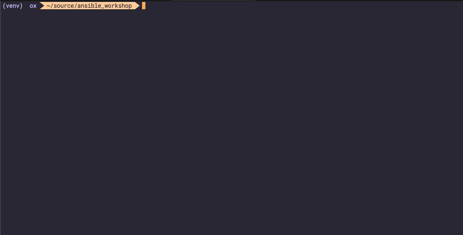

# Lab 02 - Creating Azure Resources with Ansible

In this lab we will walk through creating a playbook to provision Azure resources to run our application.  Cloud shell is recommended for this lab and all following labs; however, feel free to use any instantiation of Ansible desired.

The playbooks in this workshop are simple by design.  This is to faciliate participants with varying levels of Ansible experience and keep the focus on how Ansible can be used in conjunction with Azure.

The Azure modules that we will use are located [here](https://docs.ansible.com/ansible/latest/modules/list_of_cloud_modules.html#azure).  It is a good idea to bookmark this page if you will be using Ansible with Azure often as it is often needed to refer to the documentation.

1. Let's start by verifying our Ansible installation and version.

    ```bash
    $ ansible --version
    ```

    Verify that something similar to the block below is returned.  If not, there might be an issue with your Ansible installation.

    ```bash
    ansible 2.6.3
    config file = /Users/ox/.ansible.cfg
    configured module search path = [u'/Users/ox/.ansible/plugins/modules', u'/usr/share/ansible/plugins/modules']
    ansible python module location = /Users/ox/source/ansible/vault_test/venv/lib/python2.7/site-packages/ansible
    executable location = /Users/ox/source/ansible/vault_test/venv/bin/ansible
    python version = 2.7.10 (default, Aug 17 2018, 19:45:58) [GCC 4.2.1 Compatible Apple LLVM 10.0.0 (clang-1000.0.42)]
    ```

1. Also verify that the Azure CLI is installed.  If not install it via the [install instructions](https://docs.microsoft.com/en-us/cli/azure/install-azure-cli?view=azure-cli-latest)

    ```bash
    $ az --version
    azure-cli                         2.0.64

    acr                                2.2.6
    acs                                2.4.1
    advisor                            2.0.0
    ams                                0.4.5
    appservice                        0.2.19
    backup                             1.2.4
    batch                              4.0.1
    batchai                            0.4.8
    billing                            0.2.1
    botservice                         0.2.0
    cdn                                0.2.3
    cloud                              2.1.1
    cognitiveservices                  0.2.5
    command-modules-nspkg               2.0.2
    configure                         2.0.23
    consumption                        0.4.2
    container                         0.3.16
    core                              2.0.64
    cosmosdb                          0.2.10
    deploymentmanager                  0.1.0
    dla                                0.2.5
    dls                                0.1.9
    dms                                0.1.3
    eventgrid                          0.2.3
    eventhubs                          0.3.5
    extension                          0.2.5
    feedback                           2.2.1
    find                               0.3.2
    hdinsight                          0.3.3
    interactive                        0.4.3
    iot                                0.3.8
    iotcentral                         0.1.6
    keyvault                          2.2.15
    kusto                              0.2.2
    lab                                0.1.7
    maps                               0.3.4
    monitor                           0.2.13
    network                            2.4.0
    nspkg                              3.0.3
    policyinsights                     0.1.3
    privatedns                         1.0.0
    profile                            2.1.5
    rdbms                             0.3.10
    redis                              0.4.2
    relay                              0.1.4
    reservations                       0.4.2
    resource                          2.1.14
    role                               2.6.1
    search                             0.1.1
    security                           0.1.1
    servicebus                         0.3.5
    servicefabric                     0.1.18
    signalr                            1.0.0
    sql                                2.2.3
    sqlvm                              0.1.1
    storage                            2.4.1
    telemetry                          1.0.2
    vm                                2.2.20
    
    Python location '/opt/az/bin/python3'
    Extensions directory '/home/ox/.azure/cliextensions'
    
    Python (Linux) 3.6.5 (default, May  2 2019, 00:44:46)
    [GCC 7.4.0]
    
    Legal docs and information: aka.ms/AzureCliLegal
    
    
    Your CLI is up-to-date.
    ```

1. Login to Azure using the CLI.

    ```bash
    $ az login
    ```

1. Create a new working directory to host all of our files for the labs.  Within the new directory, create a new file that will be our playbook named `azure_infra.yml`

    ```bash
    ansible_workshop
    └── azure_infra.yml
    ```

1. Open the `azure_infra.yml` file with your favorite text editor. Start by inserting the top level playbook components: `hosts`, `connection`, `gather_facts`, `vars` and `tasks`.

    ```yaml
    ---
    - hosts: localhost # Used to indicate our playbook will run locally on our dev workstation
      connection: local # Specify that we want to use a local connection, not SSH on WinRM 
      gather_facts: no # turn off fact gathering for this playbook to increase performance
      vars: # dict of variables to be used throughout the playbook

      tasks: # Our list of plays to execute
    ```

1. Start by filling out variables that we'll need in our playbook. The variables should be self-explanatory.

    ```yaml
    vars:
      location: eastus2
      rg_name: ansible_workshop
      debug: False # this will be used to control output from our playbook
      vms:
        azvote_vms:
          azvote1:
            nic: azvote1-nic
            avset: azvote-avset
            pip: azvote1-pip
    ```

1. Now it's time to start adding plays to our playbook.  The `tasks` section takes a list of plays.  
   Azure resources live within a *resource group,* so let's start there.
   
   This first play makes use of the `azure_rm_resourcegroup` module; we just need to provide a few parameters.

    ```yaml
    tasks:
    - name: Create workshop resource group
      azure_rm_resourcegroup:
        name: "{{ rg_name }}"
        location: "{{ location }}"
        state: present
    ```

1. Ensure you're off to a good start by running the ansible playbook in *check* mode.  Check mode runs the playbook but does not actually apply any change.  This will allow us to verify our playbook is valid and is authenticating to Azure.

    ```bash
    $ ansible-playbook azure_infra.yml --check

    PLAY [localhost] **********************************************************************************************************************

    TASK [Create workshop resource group] *************************************************************************************************
    changed: [localhost]

    PLAY RECAP ****************************************************************************************************************************
    localhost                  : ok=1    changed=1    unreachable=0    failed=0
    ```

    

    If your output looks similar the preceding figure then your playbook is likely functioning as expected.

1. Like many playbooks, often times we will need to use data from one resource in another.  Register the output from the resource group creation play to a variable named `rg` by adding the register line to our play.  This is something that will be common in several plays.

    ```yaml
    tasks:
    - name: Create workshop resource group
      azure_rm_resourcegroup:
        name: "{{ rg_name }}"
        location: "{{ location }}"
        state: present
      register: rg
    ```

1. Generate a random identifier for the required unique components of the data tier.  First, set a new fact that will hold the unique id to append to the next couple of resources.

    ```yaml
    - name: set identifier
      set_fact:
        identifier: "{{ 99999 | random(start=10000, seed=rg.state.id) }}
    ```

1. Build a Virtual Network (vnet) for our Azure resources by using the `azure_rm_virtualnetwork` module.  Notice that we'll use some returned data from the resource group creation in this play.

    ```yaml
    - name: create the azure vnet
      azure_rm_virtualnetwork:
        name: "{{ rg.state.name }}-vnet"
        state: present
        resource_group: "{{ rg.state.name }}"
        address_prefixes_cidr:
        - 10.13.0.0/16
      register: vnet
    ```

1.  Now that we have a VNet, we need to create some subnets.  We'll use the `azure_rm_subnet` module for this.  As in previous resources, piggy back off of the created resources to fill in the required information for the subnet.

    ```yaml
    - name: create azvote subnet
      azure_rm_subnet:
        name: azvote-subnet
        resource_group: "{{ rg.state.name }}"
        virtual_network_name: "{{ vnet.state.name }}"
        address_prefix_cidr: 10.13.1.0/24
        state: present
      register: azvote_subnet
    ```

1. The application will be public facing so that it can reached over the Internet.  To accomplish this, create a Public IP Address that will be attached to the NIC for the VM.  Do this using the `azure_rm_publicipaddress` module.

    ```yaml
    - name: create pip for az vote web front end
        with_dict: "{{ vms.azvote_vms }}"
        azure_rm_publicipaddress:
          name: "{{ item.value.pip }}"
          resource_group: "{{ rg.state.name }}"
          domain_name: "{{ item.value.dns }}"
          state: present
          allocation_method: Dynamic
        register: azvote_pips
    ```

1. Provision the NIC that will attach to the *azvote* VM with the `azure_rm_networkinterface` module.  We continue to build on the resources in previous steps by attaching this NIC to the VNet, Subnet and assigning the Public IP created earlier.

    ```yaml
    - name: create az vote nics
      azure_rm_networkinterface:
        resource_group: "{{ rg.state.name }}"
        name: "{{ item.value.nic }}"
        subnet_name: "{{ azvote_subnet.state.name }}"
        virtual_network: "{{ vnet.state.name }}"
        ip_configurations:
        - name: primary
          primary: yes
          public_ip_address_name: "{{ item.value.pip }}"
      with_dict: "{{ vms.azvote_vms }}"
      register: azvote_nics
    ```

1. It's a good practice to put your VMs in availability sets.  So, let's go ahead and do that as well with the `azure_rm_availabilityset` module.

    ```yaml
    - name: create availability set
      azure_rm_availabilityset:
        name: azvote-avset
        resource_group: "{{ rg.state.name }}"
        sku: Aligned
        platform_fault_domain_count: 2
      register: avset
    ```

1.  Great!  That's all of the building blocks we need to create a VM.  Deploy the VM with the `azure_rm_virtualmachine` module.  Remember from the presentations that the `tags` property is common to azure_rm modules.  We haven't used it but on previous resources; however, we will use it here.  Take note of the tags section of this resource.

    ```yaml
    - name: create azvote vms
      with_dict: "{{ vms.azvote_vms }}"
      azure_rm_virtualmachine:
        resource_group: "{{ rg.state.name }}"
        name: "{{ item.key }}"
        state: present
        availability_set: "{{ avset.state.name }}"
        network_interface_names:
        - "{{ item.value.nic }}"
        admin_username: azure
        admin_password: P@$$Word123
        vm_size: Standard_DS2_v2
        managed_disk_type: Standard_LRS
        image:
          publisher: Canonical
          offer: UbuntuServer
          sku: 18.04-LTS
          version: latest
        tags:
          voting-app-tier: web
    ```

1. Create a storage account to host diagnostic data using the `azure_rm_storageaccount` module.

    ```yaml
    - name: create diag storage account
      azure_rm_storageaccount:
        resource_group: "{{ rg.state.name }}"
        name: "redisdiag{{ identifier }}"
        state: present
        type: Standard_LRS
      register: diagstorage
    ```


1. Finally, deploy the redis data layer which will be used to store the data for the voting app.  We will use the Azure Cache for Redis managed service to host the data.  At this time, there is no Ansible module to deploy a redis cache.

    No need to worry; remember we have the `azure_rm_deployment` module that provides the capablity of executing a standard ARM template.  Let's use the Azure Cache for Redis quick start template from the quick-start template GitHub repository.

    > The `azure_rm_rediscache` module is scheduled for release in Ansible version ~> 2.8

   ```yaml
    - name: deploy redis cache
    azure_rm_deployment:
      resource_group_name: "{{ rg.state.name }}"
      location: "{{ rg.state.location }}"
      parameters:
        redisCacheName: 
          value: azvote-cache-{{ identifier }}
        redisCacheSku:
          value: Basic
        redisCacheFamily:
          value: C
        redisCacheCapacity:
          value: 0
         enableNonSslPort:
           value: true
         diagnosticsEnabled:
           value: false
        existingDiagnosticsStorageAccountId:
           value: "{{ diagstorage.state.id }}"
      template_link: 'https://raw.githubusercontent.com/Azure/azure-quickstart-templates/master/101-redis-cache/azuredeploy.json'

    - debug:
      var: identifier
    ```

1. Execute the whole playbook and ensure it returns no errors.  This process will take about 20-25 minutes.

   > You can view the full playbook to this point [here](files/azure_infra.yml)

   ```bash
   $ ansible-playbook azure_infra.yml
   ```

1. Make note of the identifer that is returned at the end of the playbook with the debug command as it will be needed in later labs.

1. > [Return to the Ansible Labs Outline](../README.md)
