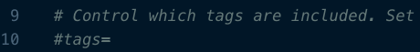
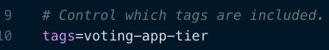
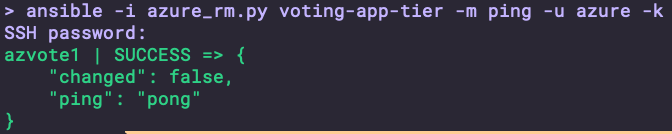
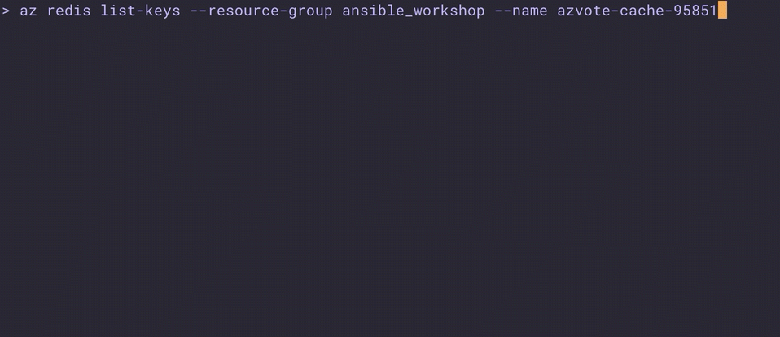
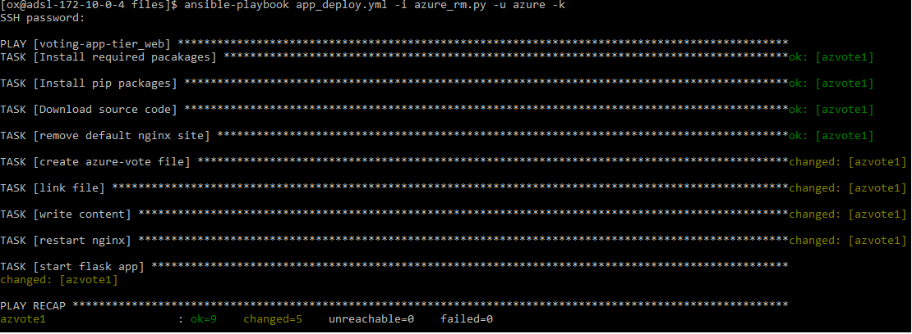

# Lab 03 - Ansible Dynamic Inventory: Azure

## Description

In this lab, we will continue to iterate upon our playbook that we created in lab 1.  Now that we have deployed our cloud infrastructure, we need to configure our IaaS components using traditional configuration management processes.  However, in the cloud world, new infrastrucutre may be deployed often and automatically for various reasons; such as, scaling up, self-healing, blue/green deployments, etc.  

We will setup our next set of plays to account for those scenarios where our infrastructure footprint changes continuously by using *Dynamic Inventory*.

> **Reminder**: The Azure modules that we will use are located [here](https://docs.ansible.com/ansible/latest/modules/list_of_cloud_modules.html#azure).  It is a good idea to bookmark this page if you will be using Ansible with Azure often as it is often needed to refer to the documentation.

## Lab

1. Let's start by verifying our Ansible installation and version.

    ```bash
    $ ansible --version
    ```

    Expected similar output:
    ```bash
    ansible 2.6.3
    config file = /Users/ox/.ansible.cfg
    configured module search path = [u'/Users/ox/.ansible/plugins/modules', u'/usr/share/ansible/plugins/modules']
    ansible python module location = /Users/ox/source/ansible/vault_test/venv/lib/python2.7/site-packages/ansible
    executable location = /Users/ox/source/ansible/vault_test/venv/bin/ansible
    python version = 2.7.10 (default, Aug 17 2018, 19:45:58) [GCC 4.2.1 Compatible Apple LLVM 10.0.0 (clang-1000.0.42)]
    ```

1. To use Azure Dynamic Inventory, we need to download the Azure Dynamic Inventory Script (azure_rm.py) and configuration file (azure_rm.ini) from the Ansible contrib directory.  Let's do that with the following commands:

    ```bash
    $ wget https://raw.githubusercontent.com/ansible/ansible/devel/contrib/inventory/azure_rm.ini
    $ wget https://raw.githubusercontent.com/ansible/ansible/devel/contrib/inventory/azure_rm.py
    ```

1. `azure_rm.py` is a script file, so let's go ahead and make that executable.

    ```bash
    chmod +x azure_rm.py
    ```

1. Update the configuration file (azure_rm.ini) to meet our needs.  Open the file with your favorite text editor and take a look. Notice that the `tags` line is commented out with a #.
   
    


     Let's remove the hash and add the tag we created when deploying our VM, `voting-app-tier`.

    

1. Let's test our inventory script to ensure it's working as expected.  We can do this by running the Ansible Inventory cli tool.

   Because we're using Dynamic Inventory, we will specify our inventory script as the inventory file.  This will execute the script and return the expected JSON output which Ansible will parse and provide the list of hosts.

   ```bash
   ansible-inventory -i azure_rm.py --list
   ```

   Another way to test our inventory is to use the `ping` module and the Ansible ad-hoc command liek below:

   ```bash
   ansible -i azure_rm.py voting-app-tier -m ping -u azure -k
   ```

    We expect our output to look something like the following:

    

1. Review your notes for the identifier that was generated in the infrastructure deployment playbook as it will be needed here.  Start by retrieving your Azure Redis Cache key from the Azure cli or the Azure Portal.  In this lab, the identifer that was generated was `95851`.  

   The redis cache is named `azvote-cache-[identifier]`

1. Also, look up one of the Azure Redis access keys in the portal or with the following command:

   ```bash
   az redis list-keys --resource-group ansible_workshop --name azvote-cache-95851
   ```

   

   > Make note of your primary key as it will be needed in the playbook.

   > New Azure modules for managing Azure Redis Cache, `azure_rm_rediscache` and `azure_rm_rediscache_facts`,  are scheduled for release in Ansible 2.8. The `azure_rm_rediscache_facts` module would provide a way to programatically lookup the Azure Redis access keys.

1. Now that Dynamic Inventory is working as expected, it's time to create the playbook that will configure the Azure infrastructure.

   Create a new playbook file in your working directory.  This lab uses the filename `app_deploy.yml`

   ```bash
   touch app_deploy.yml
   ```

1. Open the playbook in your favorite editor.  Start by adding the hosts section and some fields to control the execution of the playbook.

   The hosts section is where you see the Dynamic Inventory in action.  Normally, you specify a group of hosts that are in your static inventory file.  However, now that you're implementing dynamic inventory, you will use the tag that we assigned to the VM during deployment.  So, add the following to your playbook:

   ```yaml
   - hosts: voting-app-tier_web # Systems in Azure with voting-app-tier tag and a value of web
     gather_facts: no # increase performance by skipping fact gathering
     become: yes # run the playbook with sudo permissions
   ```

1. Refer to your notes for the identifier and the Azure Redis access key.  Add the `vars` section the playbook with your unique identifier and Azure Redis Key.

   ```yaml
   - hosts: voting-app-tier_web # Systems in Azure with voting-app-tier tag and a value of web
     gather_facts: no # increase performance by skipping fact gathering
     become: yes # run the playbook with sudo permissions
     vars:
       identifier: "95851"
       redis_key: fXrOmPsK1T1j3wbciXShC+NqTsx5g5K0QZ82I2zxVoE=
   ```

1. Add an additional section to store these values as environment variables on the node during playbook execution.

   ```yaml
   - hosts: voting-app-tier_web # Systems in Azure with voting-app-tier tag and a value of web
     gather_facts: no # increase performance by skipping fact gathering
     become: yes # run the playbook with sudo permissions
     vars:
       identifier: "95851"
       redis_key: fXrOmPsK1T1j3wbciXShC+NqTsx5g5K0QZ82I2zxVoE=

     environment:
       REDIS: "azvote-cache-{{ identifier }}.redis.cache.windows.net"
       REDIS_PWD: "{{ redis_key }}"
   ```

1. The rest of the playbook is not specific to integration of Azure and Ansible; so, simply type or copy/paste the remainder of the playbook that automates the deployment details of the Azure Voting application.

   ```yaml
   - hosts: voting-app-tier_web # Systems in Azure with voting-app-tier tag and a value of web
     gather_facts: no # increase performance by skipping fact gathering
     become: yes # run the playbook with sudo permissions
     vars:
       identifier: "95851"
       redis_key: fXrOmPsK1T1j3wbciXShC+NqTsx5g5K0QZ82I2zxVoE=

     environment:
       REDIS: "azvote-cache-{{ identifier }}.redis.cache.windows.net"
       REDIS_PWD: "{{ redis_key }}"

      tasks:
      - name: Install required packages
        apt:
          update_cache: yes
          name:
          - python
          - python-pip
          - python-virtualenv
          - nginx
          - gunicorn
          - git
          - supervisor

      - name: Install pip packages
        pip:
          name:
          - Flask
          - redis

      - name: Download source code
        git:
          repo: 'https://github.com/Azure-Samples/azure-voting-app-redis.git'
          dest: /srv/www

      - name: remove default nginx site
        file:
          path: /etc/nginx/sites-enabled/default
          state: absent

      - name: create azure-vote file
        file:
          path: /etc/nginx/sites-available/azure-vote
          state: touch

      - name: link file
        file:
          src: /etc/nginx/sites-available/azure-vote
          dest: /etc/nginx/sites-enabled/azure-vote
          force: yes
          state: link

      - name: write content
        copy:
          dest: /etc/nginx/sites-enabled/azure-vote
          content: |
            server {
                location / {
                    proxy_pass http://localhost:8000;
                    proxy_set_header Host $host;
                    proxy_set_header X-Real-IP $remote_addr;
                }
            }

      - name: restart nginx
        service:
          name: nginx
          state: restarted
          enabled: yes

      - name: start flask app
        shell: gunicorn main:app -b localhost:8000 -D
        args:
          chdir: /srv/www/azure-vote/azure-vote
   ```

1. For simplicity, a password is being used instead of SSH key pairs to login to the Azure Virtual Machines.  Therefore, you need to disable the host key checking feature of Ansible.  Do this by create a new file at `"~/.ansible.cfg"`

   ```bash
   touch ~/.ansible.cfg
   ```

   Add the following content to the Ansible Configuration file at `~/.ansible.cfg`

   ```ini
   [defaults]
   host_key_checking = False
   ```

1. With the playbook complete, execute the playbook against our virtual machine.  Remember that you haven't stored the hostname or IP address of the virtual machine anywhere; Dynamic Inventory will provide this information based on the tag filter.

   Use the `ansible-playbook` command and specify the `azure_rm.py` script as the inventory file.  The username of the user created with the VM is `azure` and the `-k` flag simply tells ansible to prompt for the password of the `azure` user.

   ```bash
   ansible-playbook -i azure_rm.py -u azure -k app_deploy.yml
   ```

   Output is expected to be similar to below:

   

1. > [Return to the Ansible Labs Outline](../README.md)
