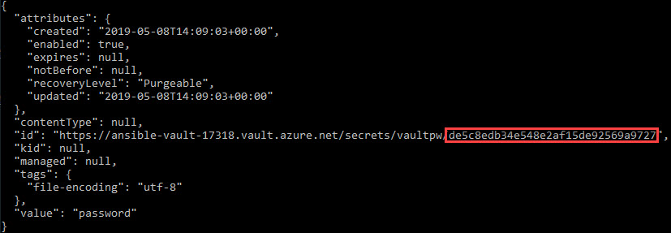

# Lab 04 - Securing Vault Password with KeyVault

## Description

To this point you have deployed an Azure Virtual Machine and an Azure Redis Cache instances.  The application is up and running; however, we have an obvious security issue with the playbook to this point.  In the play that creates the VM, we have specified the password in plain text.  It is not a good idea to push this playbook to source control without securing the password in some way.  The easiest and most common way is to use Ansible Vault.

In this lab you will secure the password with Ansible Vault.  Securing the password with Ansible Vault enables you to securely store the password in source control because it will be encrypted.  However, every time you execute the playbook you will have to enter the password manually to decrypt the file password at run time.  To alleviate that step, you will configure Azure KeyVault to store the password that unlocks your vault secrets and then use the contrib script from the Ansible repository to automatically pull the password from Azure KeyVault.

## Lab

1. Start by creating a new vault secret with Ansible to store the password.  In your working directory for the previous labs, create a new YAML variable with Ansible Vault like below:

    ```bash
    # Will prompt for a new Vault Password
    ansible-vault create secrets.yml
    New Vault password:
    Confirm New Vault password:
    ```

    This will open the newly created variable file in your default editor.  Add a value for `def_password` in the YAML file like below and save the file.

    ```yaml
    ---
    def_password: P@$$Word123
    ```

1. Verify the password is encrypted by viewing the file.

    ```bash
    [ox@adsl-172-10-0-4 files]$ cat secrets.yml
    $ANSIBLE_VAULT;1.1;AES256
    32316333346635373164376630313763343163396434343333663261333934393631373931616633
    6463623533643932623961623634366232623631613566310a343137636664396333616536323038
    34393763616132623630346132383833313033333638343861613130666136323064646530336464
    6138626430626537320a323631353431326461613561326261663836623435633839336432663730
    36356635323133336239633765626165356633376533636439313337363035383638333137333133
    3334356532656234313364336561316535363238393235323434
    ```

1. Update the `azure_infra.yml` playbook to use the newly encrypted variable file.

    Insert a new task at the top of the play list to include the new variable file.

    ```yaml
    tasks:
    - name: include secret vars
    include_vars:
      file: secrets.yml
    ```

    Also, change the `admin_password` property on the `azure_rm_virtualmachine` module to use the newly created and imported variable `def_password`.

    ```yaml
    admin_password: "{{ def_password }}"
    ```

1. Run the playbook to ensure everything is still working as expected.  There is an additional switch to add when calling the playbook now that an encrypted variable file is being imported, `--ask-vault-pass`.  This will prompt for the Vault password to unlock the Vault so that the variable can be decrypted.

    ```bash
    ansible-playbook azure_infra.yml --ask-vault-pass
    Vault password:

    
    PLAY [localhost] *******************************************************************************************************
    
    TASK [include secret vars] *********************************************************************************************
    ok: [localhost]
    ...
    ```

1. Ansible provides the capability to use a password file to store the password that unlocks the Vault.  This can be a simple text file.  While you could then use Ansible without having to type the Vault password in every time you run a playbook and you could push your playbook to source control with secret variables encrypted, you would still have a password stored in plain text on your system.

    Ansible can execute a script and return the output in place of using a plain text file for storing the Vault password.  Like the Azure Dynamic Inventory, you can use a script that will pull this password from Azure KeyVault by using the same authentication methods you used for Dynamic Inventory.

    > The account must have access to the Azure KeyVault secrets

    Create a new Azure KeyVault where the password can be stored.  Add the creation of this Azure resource to the `azure_infra.yml` playbook.

    Start by obtaining the `tenant_id` and `object_id` of your user account.  This will be needed to provide access to the secrets stored in Key Vault.

    ```bash
    # obtain the tenant_id from the account
    $ az account show

    {
      "environmentName": "AzureCloud",
      "id": "ca5e9994-0911-43f0-9c04-f38057047cd3",
      "isDefault": true,
      "name": "Microsoft Azure Internal Consumption",
      "state": "Enabled",
      "tenantId": "ud3l4234-23a1-52dw-73ba-2a5cd011db65",
      "user": {
        "name": "joe@contoso.com",
        "type": "user"
      }
    }
    ```

    > NOTE: You may need to install the jq tool to use the next command.

    ```bash
    # obtain the object_id for the user account
    $ az ad user show --upn-or-object-id myuser@contoso.com | jq -r .objectId
    b443d323-f6e5-4b1e-98cf-c5ae02546653
    ```

    After finding the `object_id` and the `tenant_id`, add the following snippet to the `azure_infra.yml` playbook, replacing the values for object and tenant id.

    ```yaml
    - name: Create Azure KeyVault
      register: kv
      azure_rm_keyvault:
        resource_group: "{{ rg.state.name }}"
        vault_name: "ansible-vault-{{ identifier }}"
        enabled_for_deployment: yes
        enabled_for_template_deployment: yes
        vault_tenant: ud3l4234-23a1-52dw-73ba-2a5cd011db65
        sku:
          name: standard
        access_policies:
        - tenant_id: ud3l4234-23a1-52dw-73ba-2a5cd011db65
          object_id: b443d323-f6e5-4b1e-98cf-c5ae02546653
          secrets:
          - get
          - list
          - set
          - delete

      - debug:
          msg: "Azure KeyVault Name: ansible-vault-{{ identifier }}"
        ```

1. Execute the playbook to create the Azure KeyVault:

    ```bash
    $ ansible-playbook azure_infra.yml --ask-vault-pass
    Vault password
    ```

1. With the Azure KeyVault created, use the Azure CLI to create the secret.

    ```bash
    # replace ansible-vault-[your_identifier]
    az keyvault secret set --name "vaultpw" --vault-name ansible-vault-17318 --value "password"
    ```

1. Make note of the secret version as it will be needed later.  This can be obtained by showing the secret with the Azure CLI and pulling it from the end of the URI.

    ```bash
    $ keyvault secret show --name "vaultpw" --vault-name ansible-vault-17318
    ```

    

    In this case, the secret version is: `de5c8edb34e548e2af15de92569a9727`.

1. Now that the master vault password stored in Azure KeyVault, the next steps are to configure Ansible to use the master password when executing playbooks.

    Start by downloading the KeyVault integration script and configuration file.

    ```bash
    # Download the integration script
    $ wget https://raw.githubusercontent.com/ansible/ansible/devel/contrib/vault/azure_vault.py

    # Download the configuration file
    $ wget https://raw.githubusercontent.com/ansible/ansible/devel/contrib/vault/azure_vault.ini
    ```

1. Make the downloaded script executable.

    ```bash
    $ chmod +x azure_vault.py
    ```

1. Configure some environment variables to specify a default password file for Ansible and to control which secret to use as the master password for the integration script.

    > This value can be stored in the Ansible configuration file as well.

    ```bash
    # Tell Ansible to use the correct password file
    $ export ANSIBLE_VAULT_PASSWORD_FILE="azure_vault.py"

    # Configure the azure_vault script
    $ export AZURE_VAULT_NAME="ansible-vault-17318"
    $ export AZURE_SECRET_NAME="vaultpw"
    $ export AZURE_VAULT_SECRET_VERSION="de5c8edb34e548e2af15de92569a9727" # Obtained in an earlier step
    ```

1. The vault integraion script can be tested alone just like the dynamic inventory script.  The expected output is simply the value of the secret that the integration script is configured to lookup.

    ```bash
    $ python azure_vault.py
    password
    ```

1. Now that the environment variables to configure Ansible and the integration script have been set, the playbook can be simply ran using the basic `ansible-playbook` command and all secrets are now secured without being stored in plain text anywhere on the system.

    ```bash
    $ ansible-playbook azure_infra.yml
    ```

1. > [Return to the Ansible Labs Outline](../README.md)
