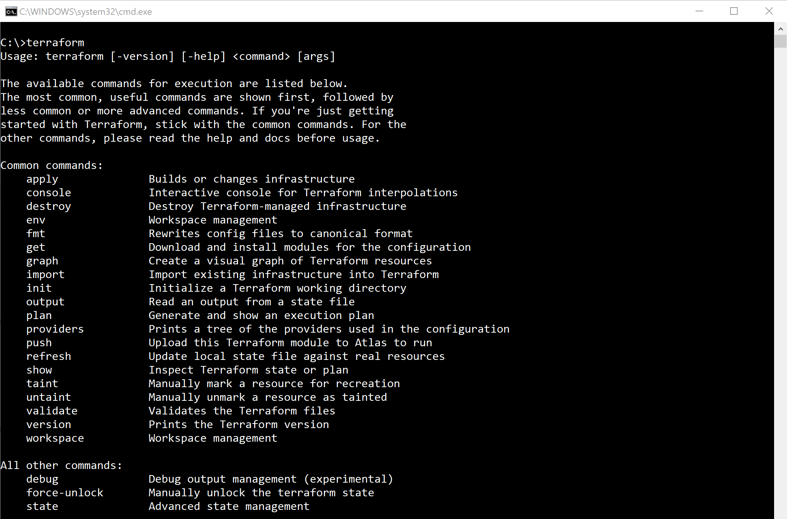
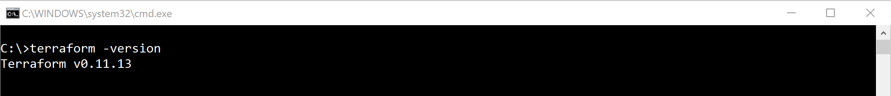
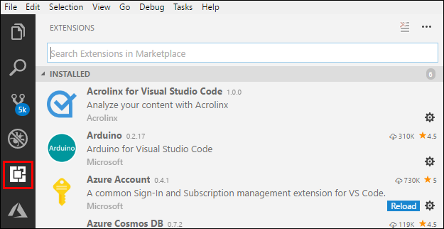
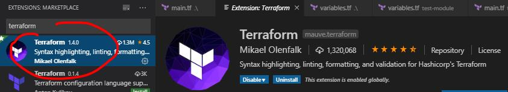
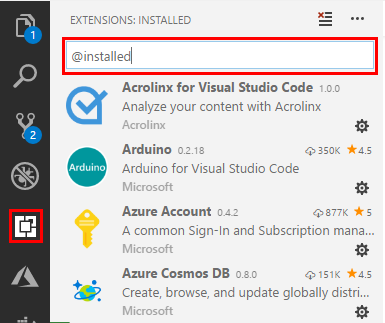

| Update: 08/12/2019  | 30 minutes to read and deploy |

---

 

# Module 7 - Lab 0 - Install and Configure Terraform

## 1. Prerequisites

- Install Visual Studio Code
    - [Windows](https://code.visualstudio.com/docs/setup/windows)
    - [macOS](https://code.visualstudio.com/docs/setup/mac)
    - [Linux](https://code.visualstudio.com/docs/setup/linux)
- Install Azure CLI
    - [Overview](https://docs.microsoft.com/en-us/cli/azure/install-azure-cli?view=azure-cli-latest)
    - [Windows](https://docs.microsoft.com/en-us/cli/azure/install-azure-cli-windows?view=azure-cli-latest)
    - [macOS](https://docs.microsoft.com/en-us/cli/azure/install-azure-cli-macos?view=azure-cli-latest)
    - Install on Linux or [Windows Subsystem for Linux (WSL)](https://docs.microsoft.com/en-us/windows/wsl/about)
        - [Install with apt on Debian or Ubuntu](https://docs.microsoft.com/en-us/cli/azure/install-azure-cli-apt?view=azure-cli-latest)
        - [Install with yum on RHEL, Fedora, or CentOS](https://docs.microsoft.com/en-us/cli/azure/install-azure-cli-yum?view=azure-cli-latest)
        - [Install with zypper on openSUSE or SLE](https://docs.microsoft.com/en-us/cli/azure/install-azure-cli-zypper?view=azure-cli-latest)
        - [Install from script](https://docs.microsoft.com/en-us/cli/azure/install-azure-cli-linux?view=azure-cli-latest)
    - [Run in Docker container](https://docs.microsoft.com/en-us/cli/azure/run-azure-cli-docker?view=azure-cli-latest)

 

## 2. Download and Install Terraform for Windows

1. Create the folder `C:\Program Files\Terraform`
2. Open Terraform download page [https://www.terraform.io/downloads.html](https://www.terraform.io/downloads.html)
3. Select your version 32-bit or 64-bit and download the zip file (e.g.: terraform_0.xx.xx_windows_amd64.zip)
4. Open the folder where you saved the downloaded file, and unzip the package in the folder you created in the step 1 `C:\Program Files\Terraform\`. Terraform runs as a single binary named **terraform.exe**
5. Now we will make sure that the terraform binary is available on the PATH. **Open Control Panel** -> **System** -> **Advanced System settings** -> **Environment Variables**
6. In the **System Variables** panel, scroll down until you find **PATH**, then select **Path** and click **Edit**
7. In the **Edit environment variable** window, click **New**
8. Enter `C:\Program Files\Terraform\`
9. Click **OK** in all three windows closing the **System Properties** completely

 

## 3. Validating Terraform installation

After installing Terraform, verify that the installation worked, and what is the Terraform version.

1. Open CMD
2. Type `terraform` press **Enter**
3. You will see the following result

    

4. Now type `terraform -version` to validate Terraform installed version (As of August 28, 2019, the latest version is 0.12.7. The version should be 0.12.7 or higher)

    

 

## 4. Install the Terraform Visual Studio Code extension

1. Launch **Visual Studio Code**
2. Open the **Extensions** view
   - Windows/Linux: `Ctrl+Shift+X`
   - macOS: `Shift+⌘+X`

    

3. Use the **Search Extensions** in Marketplace text box to search for the *Terraform* extension
4. Select **Install** [Terraform](https://marketplace.visualstudio.com/items?itemName=mauve.terraform)

    

 

## 5. Verify the Terraform extension is installed in Visual Studio Code

1. Select **Extensions**
2. Enter `@installed` in the search text box

    

3. The Terraform extension will appear in the list of installed extensions

4. You can now run all supported Terraform commands in your Cloud Shell environment from within Visual Studio Code

## 6. Module 7 - Lab 0 - Review

In this LAB we completeled the following activities

1. Installation of prerequisites to run a Terraform template, by installing Azure CLI and Microsoft VS Code
2. Download of Terraform, and system variables configuration to execute Terraform from Path in the local system
3. Validation of Terraforms by checking the Terraform version
4. Installation of Terraform extension for VS Code
5. Validation of Terraform VS Code extension