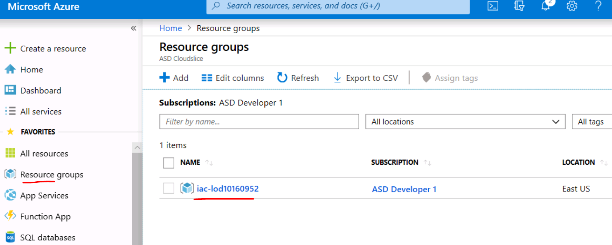
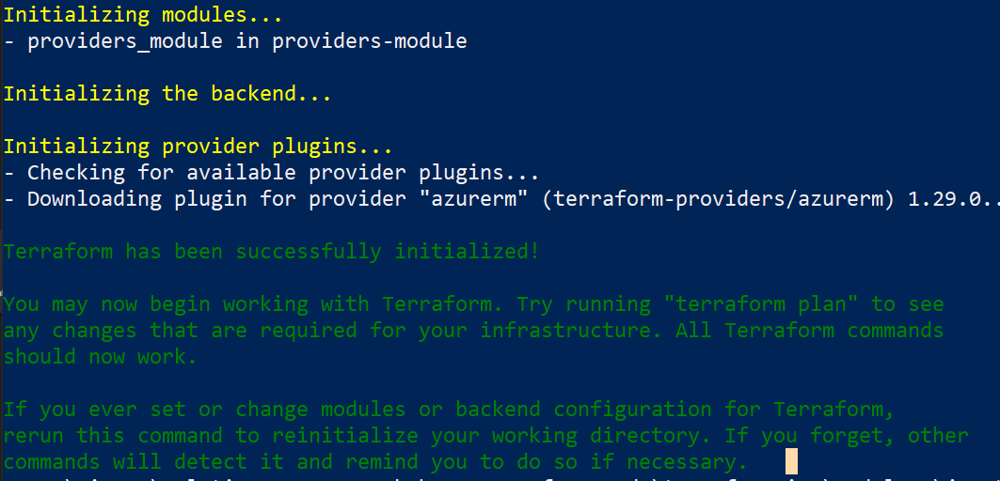
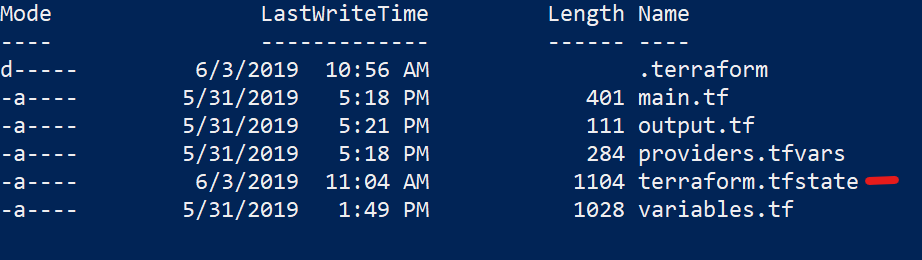

<!--
section: _SECTION_1
layout: "azurerm"
page_title: "Azure Provider: Authenticating via a Service Principal and a Client Secret"
sidebar_current: "docs-azurerm-guide-authentication-service-principal-client-secret"
description: |-
  This guide will cover how to use a Service Principal (Shared Account) with a Client Secret as authentication for the Azure Provider.
 -->


# lab-01 - Azure Provider- Authenticating

Terraform supports a number of different methods for authenticating to Azure:

* Authenticating to Azure using the Azure CLI
* Authenticating to Azure using Managed Service Identity
* Authenticating to Azure using a Service Principal and a Client Certificate
* Authenticating to Azure using a Service Principal and a Client Secret (which is covered in this guide)

---

Terraform recommends using either a Service Principal or Managed Service Identity when running Terraform non-interactively (such as when running Terraform in a CI server) - and authenticating using the Azure CLI when running Terraform locally.

## Pre-requisites
1. [Install Azure CLI](../navigation_guide.md/#Install-Azure-CLI) (Already pre-installed in the lab setup. Please continue)


### Setting up the Terraform provider

In Terraform there are multiple [providers](https://www.terraform.io/docs/providers/index.html). A provider is responsible for understanding API interactions and exposing resources. Terraform basically adds an abstraction layer to json ARM templates which are the payloads that Azure's API interacts. You may create, manage, and update infrastructure for building resources such as physical machines, VMs, network switches, containers, and more.

In this lab, we will, of course, be using the [Azure provider](https://www.terraform.io/docs/providers/azurerm/index.html). The following Provider block can be specified. The Azure Provider version we will use in this lab will be `1.29.0`

Prerequisites
1. [Open the project folder](../navigation_guide.md/#open-a-folder-in-vs-code)

2. [Open a terminal in Vs Code](../navigation_guide.md/#open-a-terminal-in-vs-code)

3.  Navigate to the `terraform_lab_dir` where you will be writing code for your lab.
```console
cd C:\Lab_Files\M07_Terraform\terraform_lab_dir
```


#### Service Principal

A Service Principal is an application within Azure Active Directory whose authentication tokens can be used as the `client_id`, `client_secret`, and `tenant_id` fields needed by Terraform (`subscription_id` can be independently recovered from your Azure account details).

It's possible to complete this task in either the [Azure CLI](../navigation_guide.md/#creating-a-service-principal-using-the-azure-cli) or in the Azure Portal - For the purpose of this lab, we will simply authenticate with our user credentials. However, it is important to note that authenticating via a Service Principal with a client secret which has the minimum rights needed to the subscription is the standard authentication method for an automation pipeline.

##### Logging in with Azure CLI

1. [Login to azure with Azure CLI](../navigation_guide.md/#login-to-azure-azure-cli)


2. At this point, we would now be able to create the Service Principal and client secret. These values would then be added to the azurerm provider like so with the below code similar to:

```
provider "azurerm" {
    version = "1.29.0"
    subscription_id = "${var.azurerm_provider_subscription_id}"
    client_id = "${var.azurerm_provider_client_id}"
    client_secret = "${var.azurerm_provider_client_secret}"
    tenant_id = "${var.azurerm_provider_tenant_id}"
}
```
1. However, for the purpose of this lab, simply append the below code to the file, `.\main.tf`

```
provider "azurerm" {
    version = "1.29.0"
}
```
Terraform will authenticate with the existing session running via azure cli.

##### Creating Terraform


1. *Append* the below code to the same file, `.\main.tf`
```hcl
data "azurerm_resource_group" "main" {
  name     = var.rg_name
}
```

>Please note, *data* sources allow data to be fetched or computed for use elsewhere in Terraform configuration. Use of data sources allows a Terraform configuration to make use of information defined outside of Terraform, or defined by another separate Terraform configuration. The code above is fetching an existing resource of type [azurerm_resource_group](https://www.terraform.io/docs/providers/azurerm/r/resource_group.html) which is a resource that comes from the `azurerm` provider. We have given it a local name "main" so that we may reference it in this fashion later, data.azurerm_resource_group.main. Please learn more [here](https://www.terraform.io/docs/configuration/data-sources.html)

5. Also, *append* the below code to the same file, `.\main.tf`
```
resource "azurerm_public_ip" "vm" {
  name                = "mypip"
  location            = data.azurerm_resource_group.main.location
  resource_group_name = data.azurerm_resource_group.main.name
  allocation_method   = "Static"
  depends_on          = [data.azurerm_resource_group.main]

  tags = {
    environment = "dev"
  }
}
```
>This will deploy a resource of type [azurerm_public_ip](https://www.terraform.io/docs/providers/azurerm/r/public_ip.html) which is a resource that comes from the `azurerm` provider. We have given it a local name "vm". Learn more on resource syntax [here](https://www.terraform.io/docs/configuration/resources.html). In addition, to learn more about the hcl configuration language, please review this [doc](https://www.terraform.io/docs/configuration/index.html)

###### Terraform Variables
In step 1 above, you see that we are using this syntax, "var.rg_name". We need to ensure that these variables and their values are constructed.
1. Append the below code in the file `.\variables.tf`

```
variable "rg_name" {
    type = "string"
    description = "The name of the resource group"
    default = "XXXXX"
}
```

You will see that the variable default value is a dummy. We will construct a [tfvars](https://www.terraform.io/docs/configuration/variables.html#variable-definitions-tfvars-files) file which will be injected into this variables file via command line argument later on.
 > Note: we could have simply appended the above code to the same `main.tf` file that the provider object sits on. However, it is best practice to separate variables from code

###### Terraform tfvars
1. Navigate to https://portal.azure.com
2. In the left blade, click *Resource Groups*
3. In the lab, there will be one Resource Group. *Copy* the name
  
4. Append the below code in the file `.\providers.tfvars` and insert the value in "<insert value>" copied from the previous step
```
rg_name = "<insert value>"
```

###### Terraform Outputs

1. Let's ensure we output the `main` object upon deploying. Later, you will run a command that will output this variable. Ensure the below code exists in `.\outputs.tf`
```hcl
output "rg_main_output" {
  value = "${data.azurerm_resource_group.main}"
}
```
>The above code will output the rg_main_output object which has a value of data.azurerm_resource_group.main, the local object you instantiated at the step above.

2. Also append, `.\outputs.tf`
```
output "vmEndpoint" {
  value = azurerm_public_ip.vm
}
```
> The above code will output the value created by the step above.

3. Save all changes (File > Save All)

##### Running Terraform

When using Terraform, there are 3 basic commands that you must know
- [terraform init](https://www.terraform.io/docs/commands/init.html) - to initialize the working directory
- [terraform plan](https://www.terraform.io/docs/commands/plan.html) - to create a plan
- [terraform apply](https://www.terraform.io/docs/commands/apply.html) - to apply the plan

##### Prerequisite steps:

1. [Open the project folder](../navigation_guide.md/#open-a-folder-in-vs-code)

2. [Open a terminal in Vs Code](../navigation_guide.md/#open-a-terminal-in-vs-code)

3.  Navigate to the `terraform_lab_dir` where you will be writing code for your lab.
```console
cd C:\Lab_Files\M07_Terraform\terraform_lab_dir
```
4. [Login to azure with Azure CLI](../navigation_guide.md/#login-to-azure-azure-cli)

##### Lab Continued

1. Let's access the terraform init, plan, and apply methods. Run `terraform init --help` and skim through the capabilities. Feel free to ask questions during this time.
2. Run `terraform plan --help`
3. Run `terraform apply --help`

4. Run `terraform init`
> Note: every time we introduce a new module, we must run Terraform init. [Terraform init](https://www.terraform.io/docs/commands/init.html) is used to initialize a working directory containing terraform configuration files. This is the first command that should be run after writing a new Terraform configuration or cloning an existing one from version control. It is safe to run this command multiple times.

You should receive something similar to the below output



4. As a result of the last step, you will see a `.terraform` folder was automatically created in your working directory. Terraform's *init* managed a few things such as:
   1. Backend Initialization (which we will cover in a later lab)
   2. Child Module Installation
   3. Plugin Installation
   > For more detail on Terraform init, please visit [here](https://www.terraform.io/docs/commands/init.html)

5.  Inject the *providers.tfvars* file when running `terraform plan -var-file="providers.tfvars"`
  >Note: [terraform plan](https://www.terraform.io/docs/commands/plan.html) is an intermittant step to run before actually deploying your resources. This command is a convenient way to check whether the execution plan for a set of changes matches your expectations without making any changes to real resources or to the state.


<!--TODO success image-->

6. Run `terraform apply -var-file="providers.tfvars"`. Then enter `yes` when prompted to perform the actions described in the output.

<!--TODO success image-->

   >Note: [terraform apply](https://www.terraform.io/docs/commands/apply.html) is the command that actually deploys your resources. This command is used to apply the changes required to reach the desired state of the configuration, or the pre-determined set of actions generated by a terraform plan execution plan.

7. Run `ls`. This will show the contents of the current working directory



>You will see that a new file was created after you ran `terraform apply`. This `.tfstate` file is needed for Terraform to keep track of the state of your target infrastructure. This state is used by Terraform to map real world resources to your configuration, keep track of metadata, and to improve performance for large infrastructures. If your `.terraform` folder uses a local backend to keep track of `.tfstate`, this state file will be updated upon each new `terraform apply`.
This [state](https://www.terraform.io/docs/state/) is stored by default in a local file named "terraform.tfstate", but it can also be stored remotely, which works better in a team environment. We will cover state more in depth in a separate lab.
8. Run `terraform plan -var-file="providers.tfvars" -out myplan` again.
 
You will see that there are no changes to apply since the code has already been applied to the target resources.

<!--TODO success image-->

9. Run `terraform apply myplan`. (Because you used the -out argument, your plan was saved to *myplan*. Simply, you do not have to re-inject the tfvars files like you did for step 6 above). You will see that no changes will be made and it was quite pointless to run an apply after seeing the plan had 0 changes in the previous step.
10. Navigate to your subscription in the Azure Portal at https://portal.azure.com and click Resource Groups in the left blade.


1.   Click on the Resource Group named and you will see that Terraform did indeed create a public ip to an existing Resource Group by authenticating through the existing azure cli session.
2.   Congrats! You finished the lab that will allow you to deploy resources using Terraform through azure cli. From this point, you are able to stand up Azure Resources in the existing resource group using Terraform.
---