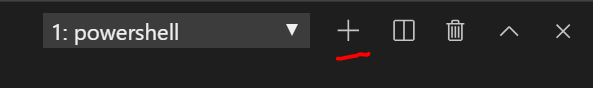
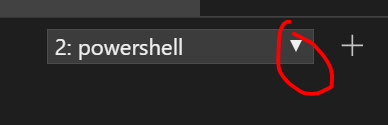

<!--
title: Deploying Resources
description: Deploying Resources. You will learn how to use the dependson, data, provisioner terraform mechanics while securing your secret with Key Vault.
services: terraform
-->

# Lab 4 - Deploying Resources
In this lab, we will learn how to deploy Azure Resources using basic Terraform mechanics. We will learn how to use Terraform's [depends_on](https://www.terraform.io/docs/configuration/resources.html#depends_on-explicit-resource-dependencies) meta-argument, [provisioner](https://www.terraform.io/docs/provisioners/index.html) types, [data](https://www.terraform.io/docs/configuration/data-sources.html) sources all while securing our secrets in Key Vault.

## Prerequisites

1. [Open the project folder](../navigation_guide.md/#open-a-folder-in-vs-code)

2. [Open a terminal in Vs Code](../navigation_guide.md/#open-a-terminal-in-vs-code)
3. [Login to azure with Azure CLI](../navigation_guide.md/#login-to-azure-azure-cli)

4.  Navigate to the `terraform_lab_dir` where you will be writing code for your lab.
```console
cd C:\Lab_Files\M07_Terraform\terraform_lab_dir
```
4.  We will create this environment in our *dev* environment. Run
```
terraform init -backend-config="configs/dev/backend.tfvars" -backend-config="access_key=$env:ARM_ACCESS_KEY"
```
5. If you haven't run this from the last lab already, run `terraform destroy -var-file="providers.tfvars"` to destroy your target infrastructure generated from the last lab.

## Lab Continued (A)
We will be writing this code at the main.tf root level. This code can definitely be placed in its own module later on - as you have learned from lab 3. For the purpose of this lab, please develop under the root directory module. If you get lost at any point, please retrace your steps or you may review *./m07-s04-final-solution.tf* which is the full and final code solution containing outputs.tf, variables.tf, and main.tf code.


1. Open *./main.tf*
2. Delete everything except

```
terraform {
  backend "azurerm" {
  }
}

provider "azurerm" {
  version         = "1.29.0"
}
```
3. Open *./outputs.tf*
4. Delete everything. We will output different resources during this lab.
5. Save all / CTRL^S

## Lab Continued (B)
1. Open *./variables.tf*
2. Ensure the below code exists
```
###################################################
# Environment Specs
###################################################
variable "location" {
  type        = string
  description = "The location of the resource group"
  default     = "eastus"
}

variable "environment" {
  type        = string
  description = "The release stage of the environment"
  default     = "dev"
}
variable "rg_name" {
    type = "string"
    description = "The name of the resource group"
    default = "XXXXX"
}

```

## Lab Continued (C)
In this lab, we will need to reference our key vault created in lab 2. This Key Vault was not created by our Terraform code, rather the script found under *./helper_scripts/set_remote_backend.ps1*. We will learn how to interact with unmanaged Terraform resources during this lab like our Key Vault.

1. Navigate to *./configs/dev/keyvault.tfvars* and insert the values shown in *./lab_output_logs/remote_backend.log*
2. Append to *./variables.tf*
```
###################################################
# Key Vault Components
###################################################

variable "key_vault_name" {
  type        = string
  description = "the name of the main key vault"
  default     = "mykeyvault"
}
variable "key_vault_resource_id" {
  type        = string
  description = "the resource id of the main key vault"
  default     = "XXXXX"
}
variable "admin_pw_name" {
  type        = string
  description = "the admin password of the vm"
  default     = "admin-pw"
}
```
## Lab Continued (D)
In this lab we will create a simple Azure Ubuntu vm. The vm will have a NIC with a public ip. The vm will sit inside a subnet within a vnet. The subnet will have a network security group with one security rule allowing port 22 for ssh.
1. Navigate to *./main.tf*
2. Place the code we created in the last lab in our root main.tf
```
locals {
  environment = trimspace(var.environment)
}
```
1. Access the existing resource group like so:
```
data "azurerm_resource_group" "main" {
  name = var.rg_name
}
```
4. Create your network security group which will allow for port 22.
```
resource "azurerm_network_security_group" "nsg" {
  name                = "nsg"
  location            = "${data.azurerm_resource_group.main.location}"
  resource_group_name = "${data.azurerm_resource_group.main.name}"

  security_rule {
    name                       = "AllowSSHIn"
    priority                   = 1300
    direction                  = "Inbound"
    access                     = "Allow"
    protocol                   = "Tcp"
    source_port_range          = "*"
    destination_port_range     = "22"
    source_address_prefix      = "*"
    destination_address_prefix = "*"
  }

  tags = {
    environment = local.environment
  }

  depends_on = [data.azurerm_resource_group.main]
}
```
> Notice the depends_on meta-argument. The depends_on statement explicitly specifies a dependency. This is only necessary when a resource relies on some other resource's behavior, but does not access any of that resource's data in its arguments. Notice how this is not actually necessary as we are already accessing data.azurerm_resource_group.main arguments via *location* and *resource_group_name*. Nonetheless, it does not hurt to be explicit.
5. Before we create a vm, we need to create the vnet that supports it. Paste the below vnet configuration. We will place the vm in subnet1. (For the purpose of the lab, we are hardcoding a couple values like the address_prefix. These values can be placed in variables later on)
```
resource "azurerm_virtual_network" "main" {
  name                = "${local.environment}-network"
  address_space       = ["10.0.0.0/16"]
  location            = "${data.azurerm_resource_group.main.location}"
  resource_group_name = "${data.azurerm_resource_group.main.name}"


  subnet {
    name           = "subnet1"
    address_prefix = "10.0.0.0/24"
    security_group = "${azurerm_network_security_group.nsg.id}"
  }

  depends_on = [data.azurerm_resource_group.main, azurerm_network_security_group.nsg]

}
```
6. We need to create the NIC. Notice in the [documentation](https://www.terraform.io/docs/providers/azurerm/r/network_interface.html) that we need to obtain the subnet id as part of the ip configuration of the NIC. The subnet1 resource is contained within the *azurerm_virtual_network.main* resource. azurerm_virtual_network.main.subnet will print out as an array of map. Rather than having to extrapolate the subnet id from azurerm_virtual_network.main.subnet, we can simply use the [data](https://www.terraform.io/docs/configuration/data-sources.html) source for [subnet](https://www.terraform.io/docs/providers/azurerm/r/subnet.html). We can do this by specifying the name, vnet name, and resource group name like so:
```
data "azurerm_subnet" "subnet" {
  name                 = "subnet1"
  virtual_network_name = "${local.environment}-network"
  resource_group_name  = "${data.azurerm_resource_group.main.name}"
}
```
7. Now, we can create our NIC and attach it to subnet1 like so:
```
resource "azurerm_network_interface" "vm" {
  name                = "${local.environment}-nic"
  location            = "${data.azurerm_resource_group.main.location}"
  resource_group_name = "${data.azurerm_resource_group.main.name}"

  ip_configuration {
    name                          = "ipconfig"
    subnet_id                     = data.azurerm_subnet.subnet.id
    private_ip_address_allocation = "Dynamic"
    public_ip_address_id          = "${azurerm_public_ip.vm.id}"
  }

  depends_on = [data.azurerm_resource_group.main, azurerm_virtual_network.main, azurerm_public_ip.vm]
}
```
8. Create the Public IP
```
resource "azurerm_public_ip" "vm" {
  name                = "mypip"
  location            = data.azurerm_resource_group.main.location
  resource_group_name = data.azurerm_resource_group.main.name
  allocation_method   = "Static"
  depends_on          = [data.azurerm_resource_group.main]
}
```
9. The ubuntu machine that we will be creating will use a simple password and username to logon to the machine. First we need to retrieve the existing Key Vault secret that was generated in lab 2 by the *./helper_scripts/set_remote_backend.ps1* script. Add the below to your main.tf file:
```
data "azurerm_key_vault_secret" "main" {
  name         = var.admin_pw_name
  key_vault_id = var.key_vault_resource_id
}
```
10. Lets create a locals argument for the vm configuration
```
locals {
  vm = {
    computer_name = "vm1"
    user_name     = "admin1234"
  }
}
```
11. Create the ubuntu machine
```
resource "azurerm_virtual_machine" "vm" {

  name                  = "${local.environment}-vm"
  location              = "${data.azurerm_resource_group.main.location}"
  resource_group_name   = "${data.azurerm_resource_group.main.name}"
  network_interface_ids = ["${azurerm_network_interface.vm.id}"]
  vm_size               = "Standard_DS1_v2"

  storage_image_reference {
    publisher = "Canonical"
    offer     = "UbuntuServer"
    sku       = "16.04-LTS"
    version   = "latest"
  }
  storage_os_disk {
    name              = "myosdisk1"
    caching           = "ReadWrite"
    create_option     = "FromImage"
    managed_disk_type = "Standard_LRS"
  }
  os_profile {
    computer_name  = local.vm.computer_name
    admin_username = local.vm.user_name
    admin_password = data.azurerm_key_vault_secret.main.value
  }
  os_profile_linux_config {
    disable_password_authentication = false
  }
  tags = {
    environment = local.environment
  }

  depends_on = [data.azurerm_resource_group.main, azurerm_virtual_network.main]

}
```
## Lab Continued (E)
1. Navigate to *./outputs.tf* and let's include our vm endpoint info
```
output "vmEndpoint" {
  value = azurerm_public_ip.vm.ip_address
}
output "username" {
  value = local.vm.user_name
}
output "password" {
  value = data.azurerm_key_vault_secret.main.value
}

```
## Lab Continued (F)
1. CTRL^S to save
2. Run `terraform fmt`. [This](https://www.terraform.io/docs/commands/fmt.html) will format the spacing of your code.
3. Go to https://portal.azure.com
4. Navigate to the key vault under your resource group, click Properties, **copy** the resource id to be pasted during the next step

5. Go to *./configs/dev/keyvaults.tfvars* and replace the value as advised in the current value for key_vault_name and key_vault_resource_id

```bash
# To be filled in lab 4
key_vault_name="<insert key_vault_name value from ..\..\lab_output_logs\remote_backend.log>"
key_vault_resource_id="<insert key_vault_resource_id value from the previous step of Lab Continued (F)"
admin_pw_name="admin-pw"
```

## Checkpoint 1
At this point you should have the following code complete:
1. *./configs/dev/keyvaults.tfvars*
2. *variables.tf* like so:
```

###################################################
# Environment Specs
###################################################
variable "location" {
  type        = string
  description = "The location of the resource group"
  default     = "eastus"
}

variable "environment" {
  type        = string
  description = "The release stage of the environment"
  default     = "dev"
}

variable "rg_name" {
    type = "string"
    description = "The name of the resource group"
    default = "XXXXX"
}

###################################################
# Key Vault Components
###################################################

variable "key_vault_name" {
  type        = string
  description = "the name of the main key vault"
  default     = "mykeyvault"
}
variable "key_vault_resource_id" {
  type        = string
  description = "the resource id of the main key vault"
  default     = "XXXXX"
}
variable "admin_pw_name" {
  type        = string
  description = "the admin password of the vm"
  default     = "admin-pw"
}
```
3. *./main.tf* like so:
```
terraform {
  backend "azurerm" {
  }
}

provider "azurerm" {
  version         = "1.29.0"
}


locals {
  environment = trimspace(var.environment)
}
locals {
  vm = {
    computer_name = "vm1"
    user_name     = "admin1234"
  }
}


data "azurerm_key_vault_secret" "main" {
  name         = var.admin_pw_name
  key_vault_id = var.key_vault_resource_id
}


resource "azurerm_resource_group" "main" {
  name     = "${local.environment}-resources"
  location = var.location
}

resource "azurerm_network_security_group" "nsg" {
  name                = "nsg"
  location            = "${data.azurerm_resource_group.main.location}"
  resource_group_name = "${data.azurerm_resource_group.main.name}"

  security_rule {
    name                       = "AllowSSHIn"
    priority                   = 1300
    direction                  = "Inbound"
    access                     = "Allow"
    protocol                   = "Tcp"
    source_port_range          = "*"
    destination_port_range     = "22"
    source_address_prefix      = "*"
    destination_address_prefix = "*"
  }

  tags = {
    environment = local.environment
  }

  depends_on = [data.azurerm_resource_group.main]
}

resource "azurerm_virtual_network" "main" {
  name                = "${local.environment}-network"
  address_space       = ["10.0.0.0/16"]
  location            = "${data.azurerm_resource_group.main.location}"
  resource_group_name = "${data.azurerm_resource_group.main.name}"


  subnet {
    name           = "subnet1"
    address_prefix = "10.0.0.0/24"
    security_group = "${azurerm_network_security_group.nsg.id}"
  }

  depends_on = [data.azurerm_resource_group.main, azurerm_network_security_group.nsg]

}

data "azurerm_subnet" "subnet" {
  name                 = "subnet1"
  virtual_network_name = "${local.environment}-network"
  resource_group_name  = "${data.azurerm_resource_group.main.name}"

  depends_on = [azurerm_virtual_network.main]
}

resource "azurerm_public_ip" "vm" {
  name                = "mypip"
  location            = data.azurerm_resource_group.main.location
  resource_group_name = data.azurerm_resource_group.main.name
  allocation_method   = "Static"
  depends_on          = [data.azurerm_resource_group.main]
}

resource "azurerm_network_interface" "vm" {
  name                = "${local.environment}-nic"
  location            = "${data.azurerm_resource_group.main.location}"
  resource_group_name = "${data.azurerm_resource_group.main.name}"

  ip_configuration {
    name                          = "ipconfig"
    subnet_id                     = data.azurerm_subnet.subnet.id
    private_ip_address_allocation = "Dynamic"
    public_ip_address_id          = "${azurerm_public_ip.vm.id}"
  }

  depends_on = [data.azurerm_resource_group.main, azurerm_virtual_network.main, azurerm_public_ip.vm]
}

resource "azurerm_virtual_machine" "vm" {

  name                  = "${local.environment}-vm"
  location              = "${data.azurerm_resource_group.main.location}"
  resource_group_name   = "${data.azurerm_resource_group.main.name}"
  network_interface_ids = ["${azurerm_network_interface.vm.id}"]
  vm_size               = "Standard_DS1_v2"

  storage_image_reference {
    publisher = "Canonical"
    offer     = "UbuntuServer"
    sku       = "16.04-LTS"
    version   = "latest"
  }
  storage_os_disk {
    name              = "myosdisk1"
    caching           = "ReadWrite"
    create_option     = "FromImage"
    managed_disk_type = "Standard_LRS"
  }
  os_profile {
    computer_name  = local.vm.computer_name
    admin_username = local.vm.user_name
    admin_password = data.azurerm_key_vault_secret.main.value
  }
  os_profile_linux_config {
    disable_password_authentication = false
  }
  tags = {
    environment = local.environment
  }

  depends_on = [data.azurerm_resource_group.main, azurerm_virtual_network.main]

}
```
4. *./outputs.tf* like so:
```
output "vmEndpoint" {
  value = azurerm_public_ip.vm.ip_address
}
output "username" {
  value = local.vm.user_name
}
output "password" {
  value = data.azurerm_key_vault_secret.main.value
}
```
## Lab Continued (G)
Let's run it
1. `terraform init -backend-config="configs/dev/backend.tfvars"  -backend-config="access_key=$env:ARM_ACCESS_KEY" `
2. `terraform plan -var-file="providers.tfvars" -var-file="configs/dev/keyvault.tfvars" -out myplan`
3. `terraform apply myplan`
4. Open a new powershell session by navigating to the terminal and clicking on the "+" icon.

5. After you apply, you should see credentials for logging on. Run `ssh <username value>@<vmEndpoint value>`
6. When prompted, enter `yes`
7. Enter the password value

## Checkpoint 2
At this point, we have created an azure vm. Let's run a quick demo on terraform [provisioner](https://www.terraform.io/docs/provisioners/index.html). Provisioners are used to execute scripts on a local or remote machine as part of resource creation or destruction. Provisioners can be used to bootstrap a resource, cleanup before destroy, run configuration management, etc.
Let's run a script on our machine.

## Lab
Within */terraform_lab_dir/*, there is a file named *test.sh*. We will copy this file to the machine by using using [file provisioner](https://www.terraform.io/docs/provisioners/file.html) and execute it via [azurerm_virtual_machine_extension](https://www.terraform.io/docs/providers/azurerm/r/virtual_machine_extension.html). The operations we want to execute on the machine are like so:

1. `chmod +x ./test.sh` to make the script executable
2. `bash test.sh >> ./helloworld.log` to execute the script and append the output to helloworld.log

The script will:
1. print the date
2. print "Hello World"

## Lab Continued (A)
To copy a file to a machine and run it, we can do the following:
1. Open *./main.tf*
2. Use [null_resource](https://www.terraform.io/docs/providers/null/resource.html) which implements the standard resource lifecycle but takes no further action. It is basically a mechanism for running operations to supplement IaC without creating your standard resources like vms, vnets, vpcs.
```
resource "null_resource" remoteExecProvisioner {

}
```
3. Let's create a local variable for the directory of the script. Add the below code:
```
locals {
  scriptWorkingDir = "/home/${local.vm.user_name}/"
}
```
4. To copy the file, let's use the [file provisioner](https://www.terraform.io/docs/provisioners/file.html). Within *file provisioner*, you provide a source, where your file exists, and destination, where to place the file on the remote machine once copied. Place this code inside the *null_resource.remoteExecProvisioner* brackets.
```
  provisioner "file" {
    source      = "./test.sh"
    destination = "${local.scriptWorkingDir}/test.sh"
  }
```
5. We also need to access the remote resource. We can simply ssh with the username and password by using the [connection provisioner](https://www.terraform.io/docs/provisioners/connection.html) like below. Place this code inside the *null_resource.remoteExecProvisioner* brackets.
```
  connection {
    host     = azurerm_public_ip.vm.ip_address
    type     = "ssh"
    user     = local.vm.user_name
    password = data.azurerm_key_vault_secret.main.value
    agent    = "false"
  }
```
6. We need to ensure the vm and the ssh port are set before attempting to copy the file. If we *plan* and *apply* at this point, you will most likely receive an error without the below code existing inside the *null_resource.remoteExecProvisioner* brackets.:
```
  depends_on = [azurerm_virtual_machine.vm, azurerm_network_security_group.nsg]
```


At the end of Lab Continued (A) you should have added the below code to main.tf:
```
locals {
  scriptWorkingDir = "/home/${local.vm.user_name}/"
}
resource "null_resource" remoteExecProvisioner {


  provisioner "file" {
    source      = "./test.sh"
    destination = "${local.scriptWorkingDir}/test.sh"
  }

  connection {
    host     = azurerm_public_ip.vm.ip_address
    type     = "ssh"
    user     = local.vm.user_name
    password = data.azurerm_key_vault_secret.main.value
    agent    = "false"
  }
  depends_on = [azurerm_virtual_machine.vm, azurerm_network_security_group.nsg]
}
```

## Lab Continued (B)
Let's create the [custom script extension](https://www.terraform.io/docs/providers/azurerm/r/virtual_machine_extension.html) that will execute our bash script. Ensure *null_resource.remoteExecProvisioner* is referenced in the depends_on object.
1. Open *./main.tf*
2. Append the below code:
```
resource "azurerm_virtual_machine_extension" "main" {
  name                 = "hostname"
  location             = "${data.azurerm_resource_group.main.location}"
  resource_group_name  = "${data.azurerm_resource_group.main.name}"
  virtual_machine_name = "${azurerm_virtual_machine.vm.name}"
  publisher            = "Microsoft.Azure.Extensions"
  type                 = "CustomScript"
  type_handler_version = "2.0"

  settings = <<SETTINGS
  {
    "commandToExecute": "chmod +x ${local.scriptWorkingDir}/test.sh; sudo apt-get install dos2unix; dos2unix ${local.scriptWorkingDir}/test.sh; /bin/bash ${local.scriptWorkingDir}/test.sh >> ${local.scriptWorkingDir}/helloworld.log"
  }
  SETTINGS

  tags = {
    environment = local.environment
  }

  depends_on = [azurerm_virtual_machine.vm, azurerm_network_security_group.nsg, null_resource.remoteExecProvisioner]
}
```
The values placed in the commandToExecute object above are unix commands that will:
1. Make the test.sh file executable
2. Install [dos2unix](https://linux.die.net/man/1/dos2unix) command line tool to convert test.sh to a UNIX format.
3. Convert the test.sh to UNIX format
4. Run the script and append it to helloworld.log


## Lab Continued (C)
At this point, you can:
1. Save the changes (Go to File and click Save All) 
2. Return to the original terminal session by clicking on the carrot and selecting the 1st session.

4. `terraform init -backend-config="configs/dev/backend.tfvars"  -backend-config="access_key=$env:ARM_ACCESS_KEY" `
5. `terraform plan -var-file="providers.tfvars" -var-file="configs/dev/keyvault.tfvars" -out myplan`
6. `terraform apply myplan`
7. Go back to the the remote session. Run `ssh <username value>@<vmEndpoint value>` and password if needed
8. Run `ls`
9. You will see the files `helloworld.log`  `test.sh`
10. Run `cat helloworld.log`
11. You will see as output:
```
Hello World

--------------------------------
```

## Checkpoint 3
At this point we copied a file and ran it through a custom script extension. If we were to make incremental changes to our *./test.sh* script, our terraform code would actually not acknowledge that the file has changed. Terraform will see that test.sh is still the file to execute and will not see a difference. 

## Lab Continued (A)
Let's test this:
1. Navigate to *./test.sh*
2. Uncomment the below code
```
echo -e $(date)
```
3. Save your work (Go to File and click Save All)
4. Return to the original terminal session by clicking on the carrot and selecting the 1st session.

5. `terraform init -backend-config="configs/dev/backend.tfvars"  -backend-config="access_key=$env:ARM_ACCESS_KEY" `
6. `terraform plan -var-file="providers.tfvars" -var-file="configs/dev/keyvault.tfvars" -out myplan`
7. `terraform apply myplan`
8. Go back to the the remote session. Run `ssh <username value>@<vmEndpoint value>` and password if needed
9. Run `ls`
10. You will see the files `helloworld.log`  `test.sh`
11. Run `cat helloworld.log` and you will not see a date (you will see the same as before)
12. Run `cat test.sh` and you will not see the uncommented code 

## Lab Continued (B)
Let's fix this. The way we can plan and apply incremental script changes is by the [triggers](https://www.terraform.io/docs/providers/null/resource.html#triggers) argument.

For Terraform to see that there is a difference in the file, we can do the below steps:
1. Open *./main.tf*
2. Let's generate and [archive](https://www.terraform.io/docs/providers/archive/d/archive_file.html) a zip file of test.sh so that later, we can take a hash of the zip file. Everytime the zip file hash changes, Terraform will know to trigger the script again.
```
data "archive_file" "init" {
  type        = "zip"
  source_file = "${path.module}/test.sh"
  output_path = "${path.module}/test.zip"
}
```
>Note: path.module is a built in terraform variable for finding the current working directory of your terraform root module.
3. Within *null_resource.remoteExecProvisioner* brackets, place the below code which will grab the hash from data.archive_file.init:
```
  triggers = {
    src_hash = "${data.archive_file.init.output_sha}"
  }
```
4. Go to *./test.sh*
5. Uncomment `args=("$@")` and `echo -e "\nhash -> "  ${args[0]}`
6. Save the changes
7. Navigate to *./main.tf*
8. Under azurerm_virtual_machine_extension.main.settings, replace the "commandToExecute" value to include the argument like so:
```
"commandToExecute": "chmod +x ${local.scriptWorkingDir}/test.sh; sudo apt-get install dos2unix; dos2unix ${local.scriptWorkingDir}/test.sh; /bin/bash ${local.scriptWorkingDir}/test.sh ${data.archive_file.init.output_sha} >> ${local.scriptWorkingDir}/helloworld.log"
```
9.  Return to the original terminal session by clicking on the carrot and selecting the 1st session.

10. `terraform init -backend-config="configs/dev/backend.tfvars" -backend-config="access_key=$env:ARM_ACCESS_KEY" ` to intialize the archive_file provisioner
11. `terraform plan -var-file="providers.tfvars" -var-file="configs/dev/keyvault.tfvars" -out myplan`
12. `terraform apply myplan`
13. Go back to the the remote session. Run `ssh <username value>@<vmEndpoint value>` and password if needed
14. Run `ls`
15. You will see the files `helloworld.log`  `test.sh`
16. Run `cat helloworld.log` and you should see that this time it was successful in appending the output of test.sh with something similar to the below output:
```
Hello World

--------------------------------

hash ->  65d6812a83744bac8b16e09af2cf945b3c8539c8
Fri Sep 6 20:14:57 UTC 2019

Hello World

--------------------------------
```
## Lab Continued (C)
Terraform was able to see the difference because you ultimately changed the commandToExecute value. This is why we see the above output. Let's actually put this incremental change code to the test now.
1. Navigate to *./test.sh*
2. Uncomment `echo -e "whoami -> $(whoami)"`
3. Save the work
4. Return to the original terminal session by clicking on the carrot and selecting the 1st session.

5. `terraform init -backend-config="configs/dev/backend.tfvars" -backend-config="access_key=$env:ARM_ACCESS_KEY" ` to intialize the archive_file provisioner
6. `terraform plan -var-file="providers.tfvars" -var-file="configs/dev/keyvault.tfvars" -out myplan`
7. `terraform apply myplan`
8. Go back to the the remote session. Run `ssh <username value>@<vmEndpoint value>` and password if needed
9. Run `ls`
10. You will see the files `helloworld.log`  `test.sh`
11. Run `cat helloworld.log` and you should see output of the whoami command

> Note: You can run Powershell DSC through the custom script extension.

# Conclusion
During this lab, you learned 
1. How to deploy multiple resources that depend on each other. 
2. How to manage resources that are not managed by Terraform
3. How to provision a machine with incremental changes
