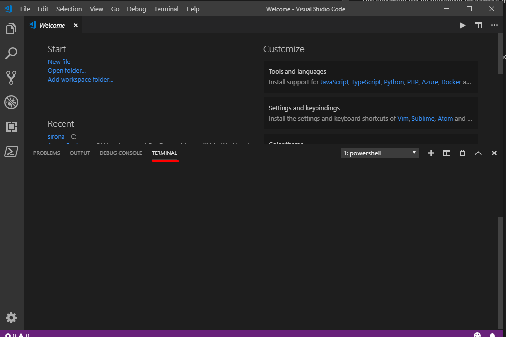

# Navigation Guide

This document will be referenced throughout the labs as each section may be referenced multiple times.

## Open a folder in VS code
1. Click the Windows button
2. Enter `code "C:\Lab_Files\M07_Terraform\terraform_lab_dir"`
3. Click *Run command*


## Open a terminal in VS code
1. Navigate to VS Code
2. Use the Ctrl+` keyboard shortcut with the backtick character (this will open the terminal at the bottom of the IDE)

3. Start typing your cmdlts

## Install Azure CLI
1. Navigate [here](https://docs.microsoft.com/en-us/cli/azure/install-azure-cli?view=azure-cli-latest) for installation instructions.

## Login to azure Powershell Az
Prerequisites:
1. You have a terminal open. If not, perform this step: [Open a terminal in VS code](#open-a-terminal-in-vs-code)

Steps:
1. Enter `Connect-AzAccount`
2. You will be prompted for credentials. Input your credentials
3. Enter `Get-AzSubscription` and copy the `id`
4. Run `Set-AzContext -Subscription <insert desired subscription id>`

## Login to azure Azure CLI
Prerequisites:
1. You have a terminal open. If not, perform this step: [Open a terminal in VS code](#open-a-terminal-in-vs-code)
2. You have Azure CLI installed. If not, perform this step: [Install Azure CLI](#install-azure-cli)

Steps:
1. Enter `az login`
2. Your default browser will pop up and prompt you for credentials. Input your credentials
3. Once logged in, you will see a page like this. At this point you may navigate back to your already authenticated powershell session
<br>

4. Once logged in - it's possible to list the Subscriptions associated with the account via:

```shell
$ az account list
```

The output (similar to below) will display one or more Subscriptions - with the `id` field being the `subscription_id` field referenced above.

```json
[
  {
    "cloudName": "AzureCloud",
    "id": "00000000-0000-0000-0000-000000000000",
    "isDefault": true,
    "name": "PAYG Subscription",
    "state": "Enabled",
    "tenantId": "00000000-0000-0000-0000-000000000000",
    "user": {
      "name": "user@example.com",
      "type": "user"
    }
  }
]
```
5. Copy the subscription ID you will be using throughout this course.
6. Enter `az account set --subscription <insert desired subscription id>`
7. Congrats! You have successfully authenticated and set your subscription.