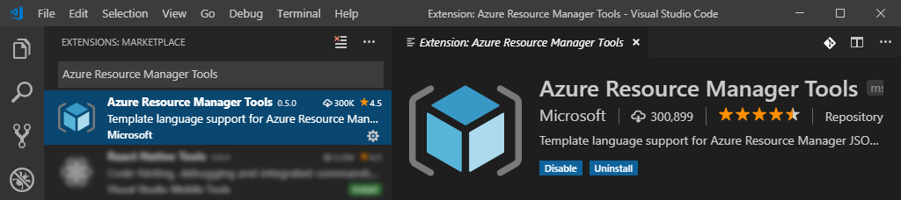
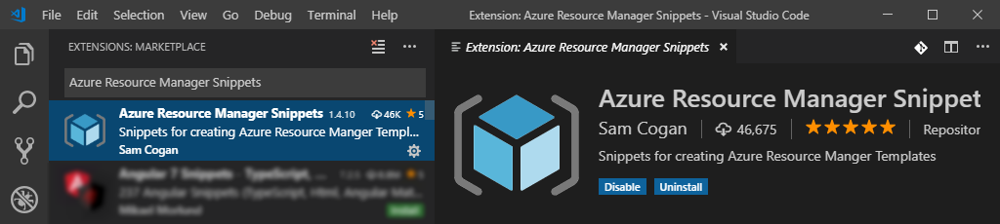
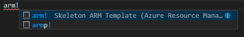
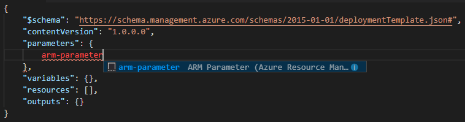
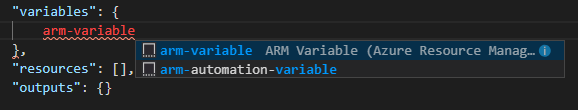
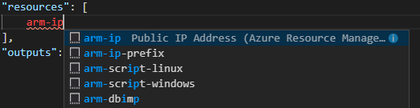
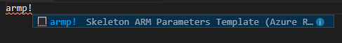
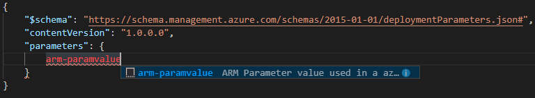

---
# This basic template provides core metadata fields for Markdown articles on docs.microsoft.com.

# Mandatory fields.
title: Demo - IntelliSense and Template Functions
description: 115-145 characters including spaces. This abstract displays in the search result.
author: MPASCO-MSFT
ms.author: MPASCO # Microsoft employees only
ms.date: 3/22/2019
ms.topic: article-type-from-white-list
# Use ms.service for services or ms.prod for on-prem products. Remove the # before the relevant field.
# ms.service: service-name-from-white-list
# ms.prod: product-name-from-white-list

# Optional fields. Don't forget to remove # if you need a field.
# ms.custom: can-be-multiple-comma-separated
# ms.reviewer: MSFT-alias-of-reviewer
# manager: MSFT-alias-of-manager-or-PM-counterpart
---
# Demo - IntelliSense and Template Functions

## Objective
- Configure Visual Studio Code for enhanced IntelliSense
- Configure user snippets for ARM templates
- Create template skeletons via snippets
- Create new parameters via snippets
- Create new variables and reference parameters with a string function
- Create a new resource via a snippet
- Reference variables for a resource value
- Deploy the completed template to Azure

### Prerequisites
- Install Visual Studio Code from https://code.visualstudio.com/
- Install Azure "Az" PowerShell module

  ```PowerShell
  #Start PowerShell in elevated mode
  Install-Module -Name Az -Force
  ```

- Have Azure subscription and authentication details ready

## Install Extensions
1. Launch Visual Studio Code
1. Open the Extensions view
   1. Windows/Linux: `Ctrl+Shift+X`
   1. macOS: `Shift+⌘+X`
1. Using the Extensions search bar, find and install the following extensions
   1. Install [Azure Resource Manager Tools](https://marketplace.visualstudio.com/items?itemName=msazurermtools.azurerm-vscode-tools)

      

   1. Install [Azure Resource Manager Snippets](https://marketplace.visualstudio.com/items?itemName=samcogan.arm-snippets)

      

## Create ARM template file
### Create ARM template skeleton
1. Create a new file named template.json
1. Open the file in Visual Studio Code
1. Type `arm!` and press `Enter` to insert the ARM template skeleton code snippet

   

   ```json
   {
       "$schema": "https://schema.management.azure.com/schemas/2015-01-01/deploymentTemplate.json#",
       "contentVersion": "1.0.0.0",
       "parameters": {},
       "variables": {},
       "resources": [],
       "outputs": {}
   }
   ```

### Add parameters to the ARM template
1. Move your cursor in between the `{}` brackets on the line containing `"parameters": {},` and press `Enter` to create a new line
1. Type `arm-parameter` and press `Enter` to insert a new parameter snippet

   

1. Change `"parameterName"` to `"projectName"` and add a description

   ```json
   {
       "$schema": "https://schema.management.azure.com/schemas/2015-01-01/deploymentTemplate.json#",
       "contentVersion": "1.0.0.0",
       "parameters": {
           "projectName": {
              "type": "string",
              "metadata": {
                   "description": "Project Name"
               }
           }
       },
       "variables": {},
       "resources": [],
       "outputs": {}
   }
   ```

### Add variables to the ARM template
1. Move your cursor in between the `{}` brackets on the line containing `"variables": {},` and press `Enter` to create a new line
1. Type `arm-variable` and press `Enter` to insert a new variable snippet

   
    
1. Change `"variableName"` to `"publicIPName"`
1. Change `"variableValue"` to `"[concat(parameters('projectName'), '-PublicIP')]"`

   ```json
   {
       "$schema": "https://schema.management.azure.com/schemas/2015-01-01/deploymentTemplate.json#",
       "contentVersion": "1.0.0.0",
       "parameters": {
           "projectName": {
              "type": "string",
              "metadata": {
                   "description": "Project Name"
               }
           }
       },
       "variables": {
           "publicIPName": "[concat(parameters('projectName'), '-PublicIP')]"
       },
       "resources": [],
       "outputs": {}
   }
   ```

### Add a Public IP resource to the ARM template
1. Move your cursor in between the `[]` brackets on the line containing `"resources": [],` and press `Enter` to create a new line
1. Type `arm-ip` and press `Enter` to insert a new Public IP resource snippet

   

1. Change the values of both `"name"` and `"displayName"` from `"IPAddress1"` to `"[variables('publicIPName')]"`
1. Change the value of `"domainNameLabel"` from `"DNS_NAME"` to `"[toLower(concat(parameters('projectName'), uniqueString(subscription().subscriptionId)))]"`

### Review completed ARM template
The completed ARM template should look as follows:

```json
{
    "$schema": "https://schema.management.azure.com/schemas/2015-01-01/deploymentTemplate.json#",
    "contentVersion": "1.0.0.0",
    "parameters": {
        "projectName": {
           "type": "string",
           "metadata": {
                "description": "Project Name"
            }
        }
    },
    "variables": {
        "publicIPName": "[concat(parameters('projectName'), '-PublicIP')]"
    },
    "resources": [
        {
            "type": "Microsoft.Network/publicIPAddresses",
            "apiVersion": "2018-08-01",
            "name": "[variables('publicIPName')]",
            "location": "[resourceGroup().location]",
            "tags": {
                "displayName": "[variables('publicIPName')]"
            },
            "properties": {
                "publicIPAllocationMethod": "Dynamic",
                "dnsSettings": {
                    "domainNameLabel": "[toLower(concat(parameters('projectName'), uniqueString(subscription().subscriptionId)))]"
                }
            }
        }
    ],
    "outputs": {}
}
```

## Create ARM parameter file
### Create ARM parameter skeleton
1. Create a new file named parameters.json and edit in Visual Studio Code
1. Type `armp!` and press `Enter` to insert the ARM parameters skeleton code snippet

   

   ```json
   {
       "$schema": "https://schema.management.azure.com/schemas/2015-01-01/deploymentParameters.json#",
       "contentVersion": "1.0.0.0",
       "parameters": {}
   }
   ```

### Add parameters to the ARM parameter file
1. Move your cursor in between the `{}` brackets on the line containing `"parameters": {},` and press `Enter` to create a new line
1. Type `arm-paramvalue` and press `Enter` to insert a new parameter snippet

   

   ```json
   {
       "$schema": "https://schema.management.azure.com/schemas/2015-01-01/deploymentParameters.json#",
       "contentVersion": "1.0.0.0",
       "parameters": {
           "parameterName": {
               "value": "parameterValue"
           }
       }
   }
   ```

1. Change `"parameterName"` to `"projectName"`
1. Change `"parameterValue"` to a value of your choosing

### Review completed ARM parameter file
The completed ARM parameter file should look as follows:

```json
{
    "$schema": "https://schema.management.azure.com/schemas/2015-01-01/deploymentParameters.json#",
    "contentVersion": "1.0.0.0",
    "parameters": {
        "projectName": {
            "value": "M04Lesson2"
        }
    }
}
```

### Deploy with PowerShell
1. Open PowerShell
1. Change directories to the folder containing the ARM template and parameters files
1. Run the following PowerShell commands to deploy the template

   ```PowerShell
   Import-Module Az
   Add-AzAccount
   New-AzResourceGroupDeployment -Name 'M04Lesson2' -ResourceGroupName 'YOUR_RG_HERE'  -TemplateFile '.\template.json' -TemplateParameterFile  '.\parameters.json' -Mode Incremental
   ```

1. Login to the Azure Portal [https://portal.azure.com](https://portal.azure.com)
1. Navigate to the resource group to see the newly created resources
1. Review the Public IP resource showing the resource name, tag and DNS name
